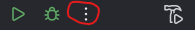
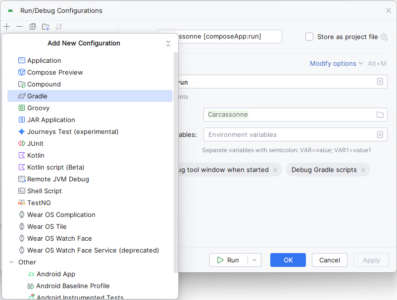
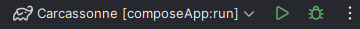
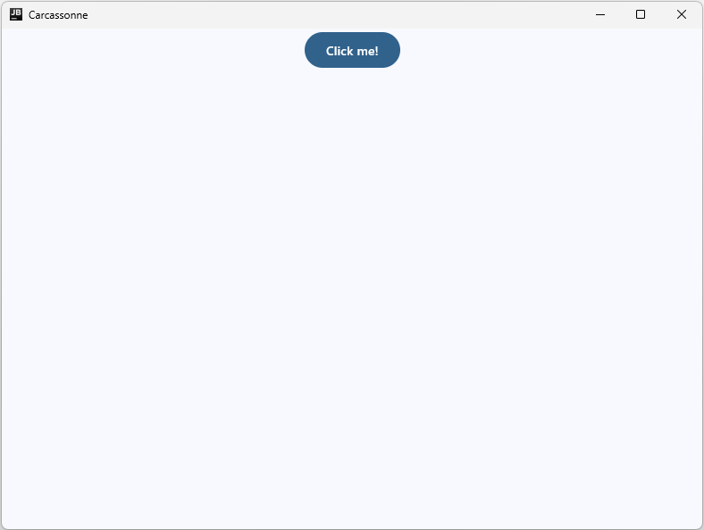

# Task 2: Tool Installation and Setup

In this training we use Android Studio as our IDE.

### Why Android Studio?
Android Studio is the official IDE for Android development, but it's also excellent for Kotlin Multiplatform (KMP) projects like the one we are going to build in this training. It provides useful tools for code editing, debugging, previewing frontend elements and also provides virtual devices for App-development.

### Task: Install Tools and Set Up the Project
1. **Download and Install Android Studio**: Go to the [Android Studio download page](https://developer.android.com/studio/archive), and download the latest Narwhal version for Windows (Android Studio Narwhal 4 Feature Drop | 2025.1.4 9. Oktober 2025). Note that there are more recent versions available like the _Otter_ versions, but unfortunately they are a bit unstable with regards to KMP-development.

2. **Install Required Plugins**: After installation,
   - Open Android Studio and go to **File > Settings > Plugins**.
   - Search for and install the **Compose Multiplatform** plugin (enables frontend element previews).

3. **Check Out the Starting Repository**: Clone or download the project from the repository. It contains an empty KMP app for Windows with the Carcassonne logo and other required assets like the tile textures and the game rules as pdf.

4. **Add run configuration**: Click on the three dots next to the bug logo in the top bar
 and then on _Edit..._ to open the _Run/Debug configurations_. Then click on the "+"-icon to add a run configuration and choose "gradle"

Then add a name for the configuration and put "composeApp:run" into the run command line

Click _OK_ and you should now see your new run configuration next to the play button:

5. **Run the App**: Select the desktop run configuration, and click _Run_ (green play button). The app should start and display a _JB_ programm window with a button called _Click me!_ that scrolls a _Carcassonne_ logo in and out.

### What It Should Look Like Now

---

[Previous: Task 1](task1.md) | [Next: Task 3](task3.md)