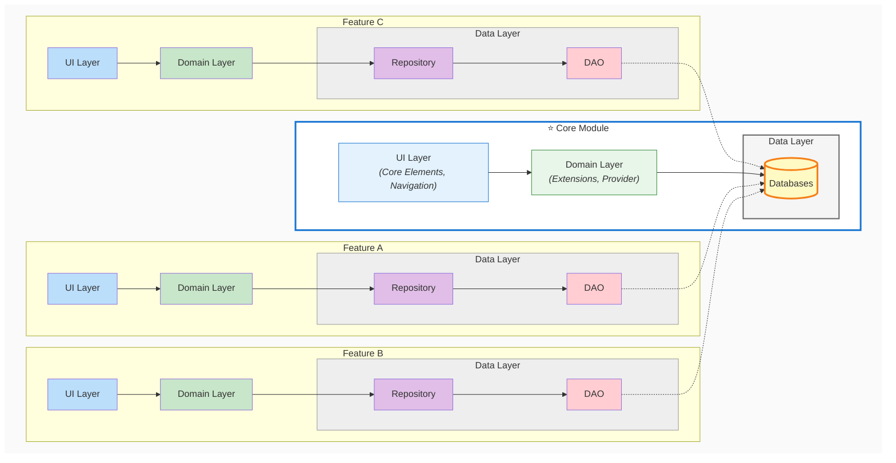

# Task 3: Understand the Project Structure

Now that you have installed Android Studio and set up the project, it's time to explore the codebase. Understanding the structure of a Kotlin Multiplatform project is crucial for making informed decisions during development.

### Explore the Carcassonne Project

1. **Open the Project**: Launch Android Studio and open the Carcassonne project you cloned in Task 2.

2. **Navigate the Directory Structure**: Take time to explore and understand the project structure.

### Project Structure Overview

```
Carcassonne/
├── composeApp/                          # Main Kotlin Multiplatform Compose application
│   ├── build.gradle.kts                 # Build configuration for composeApp
│   ├── src/
│   │   ├── commonMain/                  # Shared code for all platforms
│   │   │   ├── kotlin/
│   │   │   │   └── org.example.carcassonne/    
│   │   │   │       ├── core/            # Core utilities and shared components
│   │   │   │       ├── tile/            # Everything related to game tiles (Legekarten)
│   │   │   │       ├── ui/              # Shared UI components
│   │   │   │       └── welcome/         # Welcome/Splash screen feature
│   │   │   ├── composeResources/        # Compose UI resources (drawables, colors, strings)
│   │   │   └── resources/               # Game resources
│   │   │       ├── CarcassonneRules.pdf # Official Carcassonne game rules
│   │   │       └── CarcassonneTiles.jpg # Tile textures
│   │   ├── commonTest/                  # Shared unit tests
│   │   │   └── kotlin/
│   │   │       └── org.example.carcassonne/
│   │   │           └── core/            # Tests for core package
│   │   └── desktopMain/                 # Desktop-specific code
│   │       └── kotlin/
│   │           └── org.example.carcassonne/
│   │               └── Main.kt          # Desktop entry point
│   └── build/                           # Compiled output (generated, do not edit)
├── build.gradle.kts                     # Root build configuration
├── settings.gradle.kts                  # Gradle project settings
└── gradle/
    └── libs.versions.toml               # Centralized dependency versions
```

3. **Examine Key Files**:
    - Open `composeApp/src/desktopMain/` to see the desktop entry point
    - Review `composeApp/build.gradle.kts` to understand dependencies
    - Centralized dependency versions are managed in `gradle/libs.versions.toml`, which keeps all your library versions in one place.
    - Check `commonMain/resources/` for game rules and the tile textures - reading the rules will help you understand the game logic you're implementing.
    - Look at existing test files in `commonTest/kotlin/` - note that tests should follow the same package structure as the main code (e.g., tests for `core` package should be in `commonTest/kotlin/org.example.carcassonne/core/`)

4. **Explore the Packages**:
    - Open each package (core, tile, ui, welcome) and note what files exist
    - Read any existing Kotlin files to understand the current implementation
    - Identify which packages are fully implemented and which are still being built according to the architecture pattern (see below)

### The Kotlin Multiplatform code structure
As you can see in the Project Structure Overview, the project contains packages for both common code and platform-specific code—`commonMain` and `desktopMain`. These packages exist because Kotlin Multiplatform (KMP) enables you to ship your app to various hardware platforms: Android, iPhone, tablets, web, and desktop. While much of your codebase can be shared across platforms, some aspects need to be implemented differently or added due to specific hardware requirements or limitations. That's why you always have the `commonMain` package for shared code, complemented by platform-specific packages for code that differs by platform. In our case, since we're building only for desktop, we simply have the `desktopMain` package alongside the common code.<br>
You will learn more about Kotlin Multiplatform in later tasks.

### Code Architecture Pattern
This project follows Google's recommended [App Architecture](https://developer.android.com/topic/architecture).

This approach gives us **separation of concerns**—each layer has one job and doesn't need to know how the others work. Features become modular and independent, so you can add a new feature without touching existing code. Testing becomes easier because you can test each layer in isolation. And when your app grows, new features slot in cleanly without increasing complexity.

#### The Three-Layer Architecture

According to this architecture, the app should be divided into three main layers, the UI layer, the domain layer and the data layer.

<div style="text-align: center;">
  
</div>

The **UI Layer** contains the Jetpack Compose code for the user interface—all graphical elements and user interactions.<br>
The **Domain Layer** sits between the UI and data layers, containing the business logic and state management that updates the UI when values change.<br>
The **Data Layer** handles all data sources like databases and APIs, providing repositories that offer clean interfaces for the domain layer to read and update data without worrying about implementation details.

#### Vertical Slice Architecture

Instead of organizing code by layer (all UI together, all domain together, etc.), we organize by **feature**. Each feature package contains all three layers it needs:




In general, the Data Layer consists of the following components.

**Data models** (not shown) are simple data classes that represent the structure of your data — think of them as the shape of a database table row.<br>
**DAOs (Data Access Objects)** handle the low-level database operations like inserting, updating, deleting, and querying data directly from the database.<br>
**Repositories** sit on top of DAOs and provide a cleaner interface for the domain layer. Instead of the domain layer calling multiple DAO functions, it calls a single repository function that internally uses one or more DAOs. This keeps the domain layer completely isolated from database details—it doesn't need to know or care how data is stored or retrieved.


#### The Core module
The core package is special because it's shared across all features. It provides reusable UI components and navigation logic, utility functions and extensions, the database connection that all features depend on, and dependency injection to wire everything together. All feature repositories connect to the same databases managed by the core module.

!!! note
    This introductory course focuses on Kotlin and architecture principles rather than database implementation. Instead of using real databases and DAOs, we'll simulate these concepts with simple Kotlin Collections for temporary data and JSON files for persistent storage. This keeps the focus on learning the architecture pattern itself, which you can later apply to real databases.


## Next Step

In Task 4, you'll create the data structures to represent each tile with its properties based on the game rules. Then you'll write code to load and parse the game tiles from the tile texture image and display them in the UI so you can see your work come to life.

---

[Previous: Task 2](task2.md) | [Next: Task 4](task4.md)
