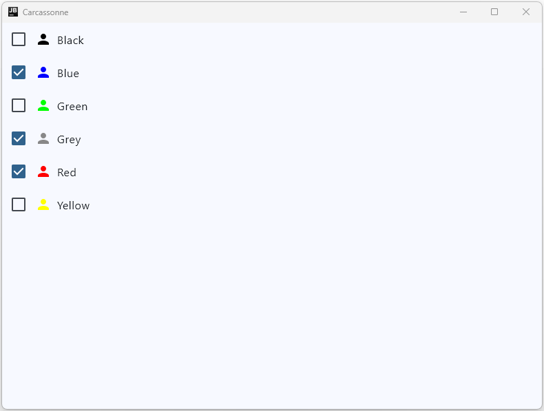
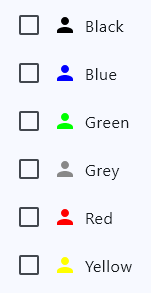
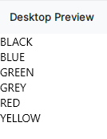
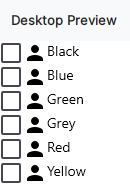
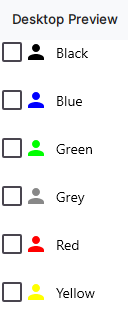
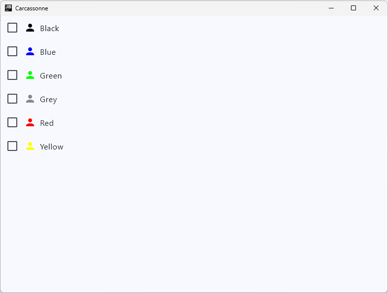

# Task 2: Create a reactive Screen in Jetpack Compose

In this task, we will create a screen that lets the user select and deselect players for a game.



## The Select Player Screen

In the finished game, the first screen a user will see after the welcome screen is the "Select Player Screen". This screen lets users choose which players (colors) will participate in the game. In this task, we'll implement a prototype of this screen (shown above) that incorporates basic layouts and clickability, but doesn't connect to the backend yet. We'll wire up the backend in later tasks.

### Preparation

Before we start implementing the screen, we need to set up the necessary data structures and packages. According to our vertical slice architecture, this means we first create a new package for the *player*-related code.

!!! example "Task"
    Create a new package `player` next to the `tile` package which includes subpackages for all three layers of the architecture (data, domain, presentation). Then add some elements similar to the `tile` package:
    
    - Create a `PlayerColor` enum in the data layer according to the game rules.
    - Create a `Player` data class that includes the player color, number of followers and points (initialize followers to the maximum number of followers and the points to 0).
    - Add a `SelectPlayerScreen.kt` file to the presentation layer and create an empty composable `SelectPlayerScreen()` that has a modifier as argument.

The maximum number of followers one player can have is a global constant and will be used in multiple places, so we can add it as a top-level constant to the `core` package. Create a `Constants.kt` file on the root level of the `core` package and add the following constant:

```kotlin
const val MAX_NUM_OF_FOLLOWERS = 8
```

Use this constant for initializing the followers in the `Player` data class.

### Implement the Screen

Now let's move to the `SelectPlayerScreen()` composable. This screen will let users select which players (colors) participate in the game.

First, we'll add a Preview for the `SelectPlayerScreen()` so we can see what we're building as we go.

```kotlin
@Preview
@Composable
fun SelectPlayerScreenPreview() {
    SelectPlayerScreen()
}
```

The screen that we want to create should look like this:



Think about what kind of layout structures you can see in this screen. How are the elements arranged?

!!! tip "Layout"
    The way elements are arranged relative to each other is one of the most important concepts in frontend development. Before you start coding, take a moment to analyze the screen you want to create and identify the layout structures—use paper and a pencil to sketch different layouts until you find an ideal one. This will help you structure your code in a way that's easy to read and maintain.

The outermost structure is a Column that arranges the individual options vertically. Each option consists of a Row with a checkbox and an option display. The option display itself is also a Row that contains a colored icon and text. So we have a Column containing Rows that contain Rows.

We'll start simple and first just add a Column with Text elements for each player color:

```kotlin
@Composable
fun SelectPlayerScreen(
    modifier: Modifier = Modifier,
) {
    Column(
        modifier = modifier
    ) {
        PlayerColor.entries.forEach {
            Text(it.name)
        }
    }
}
```

Render the preview and check that it looks something like this:



!!! example "Task"
    Replace the `Text` composable with a `Row` that contains a `Checkbox` composable and a `Row` for the option. The checkbox should be unchecked by default. Set `onCheckedChange = null` for now. The option row should contain an `Icon` composable using `Icons.Filled.Person` and a `Text` with the name of the color. Wrap the name of the enum entry in the `capitalizeFirstChar()` function from the `core.domain` package to format it nicely. 

After you have completed the task, the preview should look like this:



To add the colors to the icons, we can use the `tint` parameter of the `Icon` composable. But first, we need to define a mapping from the `PlayerColor` enum to actual colors.

!!! example "Task"
    Add an extension function `PlayerColor.toColorCode(): Color` to the `PlayerColor` enum that returns a color code for each player color. Use the codes provided by the `androidx.compose.ui.graphics.Color` class, for example `Color.Black` for black, `Color.Red` for red, etc. Then use this function to set the tint of the icon in the option row to the corresponding color.

After you have completed this task, the preview should look like this:


The last layout step is to arrange and align the elements properly. In our case, we want to match the target design shown above.

We start with the outermost Column. We want some space between the options and we want them all aligned to the left. So we add the following parameters to the `Column`:

```kotlin
horizontalAlignment = Alignment.Start,
verticalArrangement = Arrangement.spacedBy(24.dp)
```

Next we go to the outer Row and add an alignment parameter to vertically center the checkbox and option row:

```kotlin
verticalAlignment = Alignment.CenterVertically
```

Finally, we align the elements in the option row:

```kotlin
horizontalArrangement = Arrangement.Start,
verticalAlignment = Alignment.CenterVertically
```

Additionally, we add some spacing between the icon and the text using a `Spacer` composable (where do you have to put it?):

```kotlin
Spacer(modifier = Modifier.width(8.dp))
```

You should now see something like this in the preview:



You'll notice there's still a slight layout difference in the spacing between the option row and the checkbox. This will change once we make the checkbox clickable, since that adds padding around it (to make it easier to click). Before we add clickability, let's simulate this by adding `Modifier.padding(12.dp)` to the checkbox and removing the verticalArrangement parameter from the Column (since the padding already adds 24dp of space—2×12dp—between the rows).

Now the Column layout should match the target design. However, the target has a different background color and uses different fonts. The background comes from the Surface composable, and the fonts come from our `AppTheme`.

!!! example "Task"
    Wrap the Column in a `Surface` composable and set the background color to `MaterialTheme.colorScheme.surface`. Then wrap the `SelectPlayerScreen()` in the `SelectPlayerScreenPreview()` with the `AppTheme` composable to apply the theme to the preview.

We apply the theme to the preview rather than the screen itself because the app has multiple screens that should all use the same theme—keeping the theme consistent across the entire app. We'll apply the theme later to the composable responsible for navigation between screens.

### Display the Screen in the App

Now that we've created the `SelectPlayerScreen()`, let's display it in the app. Since we don't have navigation implemented yet, we'll simply replace the `WelcomeScreen()` with the `SelectPlayerScreen()` in `main.kt` to verify it works:

```kotlin
fun main() = application {
    Window(
        onCloseRequest = ::exitApplication,
        title = stringResource(Res.string.app_name),
    ) {
        AppTheme {
            SelectPlayerScreen()
        }
    }
}
```

Start the app. You should see the following:



Right now we can only look at it—we can't click or interact with anything yet. That's because we haven't added any click handlers or state to the screen.

### Make the screen interactive

The first thing we need to make our screen interactive is a state variable that tracks which players are selected.

!!! example "Task"
    Add a mutable `selectedPlayerColors` state to the `SelectPlayerScreen()` that holds a list of the selected player colors. Initialize it with an empty list.

Now go to the `Checkbox` composable and set the `checked` parameter to check whether the corresponding player color is in the `selectedPlayerColors` list. Then set the `onCheckedChange` parameter to a lambda that adds the player color to the list if it's not already there, or removes it if it is. Also, you can now remove the padding modifier we added to simulate the click area, since the checkbox is now clickable and has its own padding.

```kotlin
Checkbox(
    checked = selectedPlayerColors.contains(color),
    onCheckedChange = {
        selectedPlayerColors = if (selectedPlayerColors.contains(color)) {
            selectedPlayerColors - color
        } else {
            selectedPlayerColors + color
        }
    }
)
```

Note that we can't use `selectedPlayerColors.add(color)` or `selectedPlayerColors.remove(color)` because that wouldn't trigger a recomposition. The state wouldn't be updated with a new value—we'd just be modifying the existing list. By creating a new list with the added or removed color, we trigger a recomposition and the screen updates accordingly.

Start the app again and check that you can now select and deselect the player colors by clicking on the checkboxes.

#### Improve clickability

Right now, you can only click the checkbox itself to select or deselect a player color. It would be more user-friendly if clicking anywhere on the row selected or deselected the player. To do this, we can add a `Modifier.selectable()` to the outer Row of each option.

!!! example "Task"
    Add a `Modifier.selectable()` to the outer Row of each option that uses the same logic as the checkbox for the `selected` and `onClick` parameters. Retest the app and verify that you can now click anywhere on the row to select or deselect a player color.

## Summary

You've now built a complete interactive screen in Jetpack Compose from scratch. You implemented complex nested layouts using Columns and Rows, applied Material Design theming, and made the screen interactive with mutable state. You've seen how Compose's declarative approach makes it straightforward to build reactive UIs — when state changes, the UI automatically updates. Most importantly, you've learned to think about layout structure before coding and to iterate quickly using Previews. This workflow—structure, implement, preview, refine—will serve you well for all future screens.

In the next task, we'll implement navigation so users can move between the welcome screen and this player selection screen.

---

[Previous: Task 1](task1.md) | [Next: Task 3](task3.md)