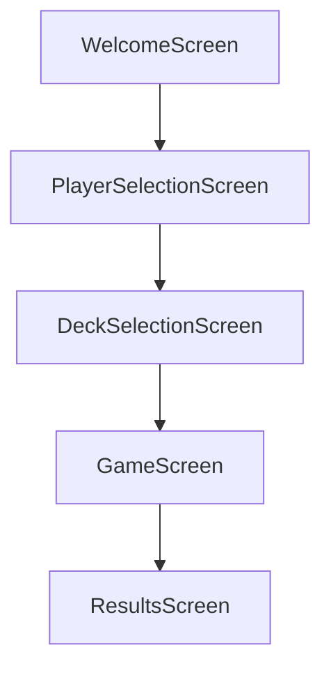
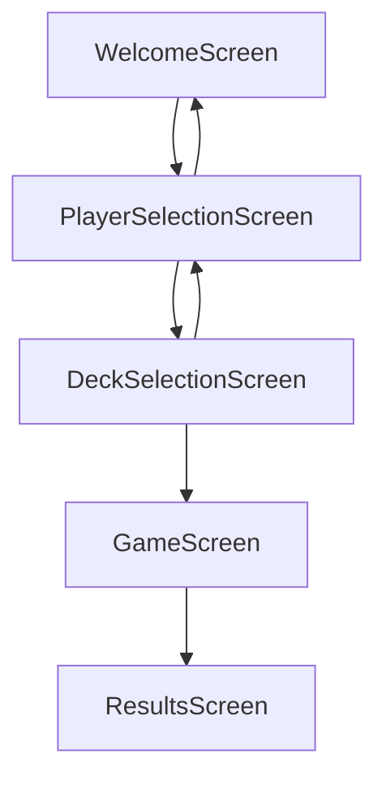
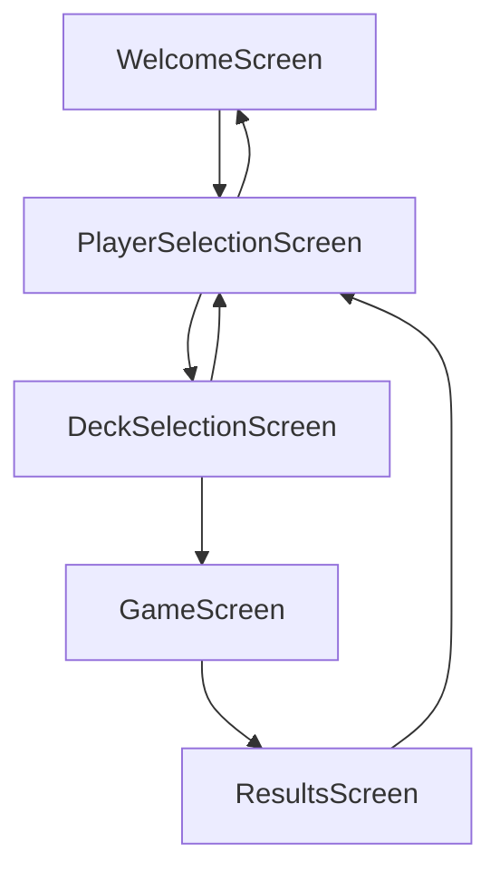

# Task 3: Navigation

In this task, we will learn how navigation in Jetpack Compose works and how to implement it in our Carcassonne app. Navigation is essential for moving between different screens in your app, such as from the welcome screen to the player selection screen.

## The navigation graph

A navigation graph is a visual representation of the different paths a user can take in an app to navigate between screens. Let's say, for example, our Carcassonne app has the following screens:

- Welcome Screen
- Player Selection Screen
- Deck Selection Screen
- Game Screen
- Results Screen

One way to connect these screens is to simply navigate to the next screen in the flow after a certain user interaction. For example, a "Start" button on the Welcome screen or a "Continue" button on the two selection screens would create a navigation graph like this:



However, this graph doesn't let users go back to previous screens — for example, if they want to change the number of players after selecting an expansion. To allow this, we can add back navigation:



Finally, we want users to be able to start a new game after seeing the results, so we add a path from the Results Screen back to the Player Selection Screen:



This is the navigation graph we'll implement in our app.

## The NavHost composable and the NavHostController

In Jetpack Compose, we use the `NavHost` composable to define our navigation graph and the `NavHostController` to control navigation actions. The `NavHost` is a container to which we add all our composable destinations (screens). The `NavHostController` provides the functions that let us navigate between these destinations.

The NavHost is a core presentation component and thus belongs in the presentation layer of the `core` package.

!!! example "Task"
    Add a `presentation` package to the `core` module and add a `NavGraph.kt` file to it.

The NavHost will be our central entry point for the app, so it's the perfect candidate for the composable that gets wrapped in our AppTheme.

!!! example "Task"
    Add a composable `CarcassonneNavHost()` to the `NavGraph.kt` file that contains a `NavHost` composable (from `androidx.navigation.compose`) wrapped in the `AppTheme`.

Our `NavHost` needs a `NavHostController` and a `startDestination`. We'll use parameters of the `CarcassonneNavHost()` composable for both.

!!! example "Task"
    Add a `navController` parameter of type `NavHostController`, a `startDestination` parameter of type `String` and a `modifier` parameter of type `Modifier` with a default value to the `CarcassonneNavHost()` composable and pass all of them to the `NavHost`.

Your composable should now look like this:

```kotlin
@Composable
fun CarcassonneNavHost(
    navController: NavHostController,
    startDestination: String,
    modifier: Modifier = Modifier
){
    AppTheme {
        NavHost(
            modifier = modifier,
            navController = navController,
            startDestination = startDestination
        ){

        }
    }
}
```

The start destination of the NavHost is the first screen shown when the app starts. In our case, that's the Welcome Screen. For the startDestination parameter to work, the injected destination string must match one of the routes defined in the NavHost. Let's add the route for the Welcome Screen:

```kotlin
@Composable
fun CarcassonneNavHost(
    navController: NavHostController,
    startDestination: String,
    modifier: Modifier = Modifier
){
    AppTheme {
        NavHost(
            modifier = modifier,
            navController = navController,
            startDestination = startDestination
        ){
            composable(route = "welcome_screen"){
                WelcomeScreen()
            }
        }
    }
}
```

All routes in the NavHost are defined as composable destinations. Each destination has a unique route string and a composable function that defines the UI for that destination. In this case, we've defined a destination with the route "welcome_screen" that shows the `WelcomeScreen()` composable.

Now go back to the `main.kt` file and replace the `SelectPlayerScreen()` from the last task with our new `CarcassonneNavHost()`. You can also remove the `AppTheme` from `main.kt` since we already wrap our NavHost in the AppTheme.

For the navController, inject the `rememberNavController()` function from `androidx.navigation.compose`, and for the startDestination, inject the route string "welcome_screen".

Start the app and you should see the Welcome Screen again. This time, though, we didn't just show the Welcome Screen directly — we're running a NavHost that navigated to the Welcome Screen as the start destination.

### Navigation destinations

As you might have noticed, we had to type the destination string "welcome_screen" in two places: once in the NavHost and once in the main function. This isn't ideal—if we make a typo in one of the strings, navigation won't work and the bug can be hard to find. Plus, the string was defined outside the Welcome Screen composable, which isn't great either since the route string is a property of the screen and should be defined close to it.

To solve this, we'll create a `NavigationDestination` interface with a route and a titleRes (string resource for the screen title) property. Each screen will implement this interface and provide its own route and titleRes. This way, we can use the route property to navigate to the screen, and we can use the titleRes property to show the screen's title in the app bar.

!!! example "Task"
    Create a `NavigationDestination` interface in the `core/presentation` package with a `route` property (String) and a `titleRes` property (StringResource). Then go to the `WelcomeScreen.kt` file and add an object `WelcomeDestination` above the `WelcomeScreen()` composable that implements the interface. Use appropriate values for route and titleRes (use the `app_name` resource as the title).

Now we can use the `WelcomeDestination.route` in the NavHost and in the main function instead of the hardcoded string "welcome_screen".

```kotlin
fun main() = application {
    Window(
        onCloseRequest = ::exitApplication,
        title = stringResource(Res.string.app_name),
    ) {
        CarcassonneNavHost(
            navController = rememberNavController(),
            startDestination = WelcomeDestination.route
        )
    }
}
```

### Using the NavController to navigate between screens

The NavController provides several functions for navigating between destinations. The most common is `navigate()`, which takes a route string and navigates to the destination with that route. These functions can be called from screen composables—for example, when a button is clicked—and need to be injected as parameters so the composable can call them.

!!! example "Task"
    Go to the `WelcomeScreen()` composable and add a parameter below the modifier of type `() -> Unit` called `navigateToSelectPlayerScreen`. Then add an empty lambda to the Preview for the `navigateToSelectPlayerScreen` parameter to resolve the preview error.

The `navigateToSelectPlayerScreen` function can now be called anywhere in the `WelcomeScreen()` composable to trigger navigation to the Player Selection Screen.

For testing purposes, replace the lambda `{ showContent = !showContent }` in the Button's `onClick` property with the `navigateToSelectPlayerScreen` function (without parentheses—we're just passing the function reference).

To inject the actual navigation action, go back to our `CarcassonneNavHost` and inject the `navigate()` function of the navController:

```kotlin
composable(route = WelcomeDestination.route) {
    WelcomeScreen {
        navController.navigate("")
    }
}
```

Note that we used curly brace syntax for the navigation lambda argument of `WelcomeScreen`.

To give the navigation function meaning, we still need to define the route for the Player Selection Screen.

!!! example "Task"
    Create a `SelectPlayerDestination` object in the `SelectPlayerScreen.kt` file that implements the `NavigationDestination` interface. Implement the route and titleRes properties with appropriate values (you'll need to add a string resource for the title). Then use the route property of `SelectPlayerDestination` in the navigate() function of the Welcome Screen.

Finally, we need to register the Player Selection Screen as a destination in the NavHost.

!!! example "Task"
    Add a composable destination for the Player Selection Screen to the NavHost in the `CarcassonneNavHost()` composable using the route from `SelectPlayerDestination` and showing the `SelectPlayerScreen()` composable. Note that composables in the NavHost aren't comma-separated—they're just listed one after another.

Now start the app and click the "Click me!" button on the Welcome Screen. Instead of the animation, you should now see that the app navigates to the Player Selection Screen.


#### Navigate back

The NavController also provides a `popBackStack()` function that lets us navigate back to a previous destination. We can use this in the Player Selection Screen to let users return to the Welcome Screen.

!!! example "Task"
    Add a `navigateBack` parameter of type `() -> Unit` to the `SelectPlayerScreen()` composable. Then add a Button to the `SelectPlayerScreen()` that calls `navigateBack` when clicked. Don't forget to fix the Preview by adding an empty lambda to the `navigateBack` parameter.

Go back to the `CarcassonneNavHost()` and inject a lambda to the `navigateBack` parameter of `SelectPlayerScreen()` that calls `popBackStack()` with the route of the Welcome Screen as the first parameter and `inclusive` set to false. This pops the back stack until it finds the Welcome Screen and navigates back to it.

```kotlin
composable(route = SelectPlayerDestination.route) {
    SelectPlayerScreen(
        navigateBack = { navController.popBackStack(WelcomeDestination.route, inclusive = false) }
    )
}
```

Now start the app and try navigating between the Welcome Screen and the Player Selection Screen. You should be able to move back and forth between the two screens.


## Implement the rest of the navigation graph

Now that you know how to navigate between screens, you can implement the rest of the navigation graph outlined in the first section by adding the remaining screens as destinations in the NavHost and wiring up navigation actions in the UI.

!!! example "Task"
    Add the following:
    
    - A `SelectDecksScreen` in the presentation layer of the `tile` package
    - New `game` and `results` packages with their respective presentation layers
    - A `GameScreen` in the `game.presentation` package
    - A `ResultsScreen` in the `results.presentation` package
    
    For each screen, create the `NavigationDestination` object and a composable that displays a title text (to identify the screen) and simple navigation buttons. Register all screens in the NavHost and inject the appropriate navigation actions so the buttons navigate according to the navigation graph.


## Summary

You've now learned navigation in Jetpack Compose. You learned how to design a navigation graph that maps out the user's journey through your app, implemented the `NavHost` and `NavHostController` to manage destinations, and created a clean `NavigationDestination` interface that keeps route definitions close to the screens they represent. You've seen how to pass navigation functions as lambda parameters, and you've wired up both forward navigation and back navigation throughout the app. With this foundation, you can now build complex multi-screen apps with clear, maintainable navigation patterns. Every screen knows where it can go, and the navigation logic stays cleanly separated from the UI.

In the next task, we will focus on beautifying our screens and introduce reusable frontend elements to make our UI more consistent and easier to build.

---

[Previous: Task 2](task2.md) | [Next: Task 4](task4.md)