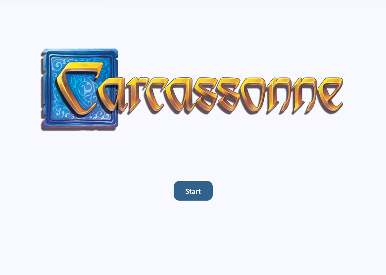
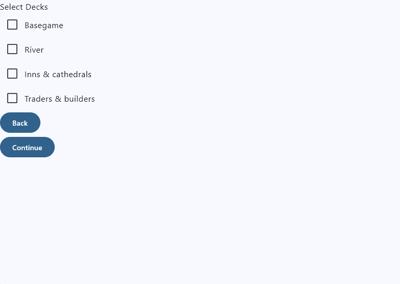
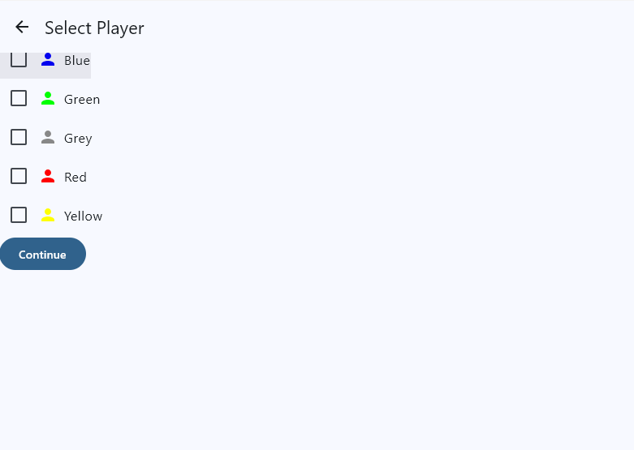
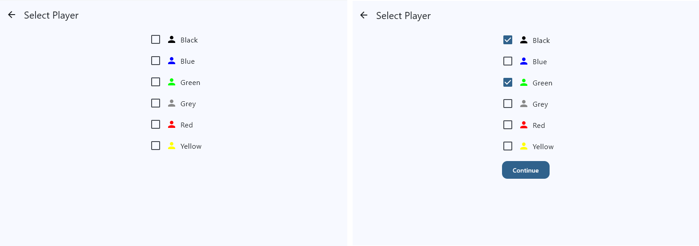
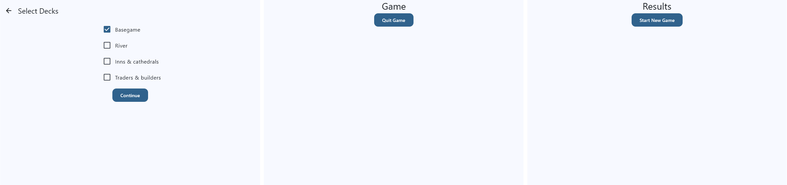

# Task 4: Beautify the Screens

In this task, we will make the screen design consistent and more appealing. We will also streamline the code structure and create reusable frontend elements that can be used across different screens. This makes it easier to maintain a consistent look while reducing the amount of code we need to write for each screen.

## The Welcome Screen

In the beginning of the course, the Welcome Screen was a simple appetizer with some flashy animations to get you excited about the course. Now it's time to make it a real welcome screen that gives you a clear entry point into the game.

The new Welcome Screen should look like this:



There should be no animation anymore, and the "Start" button navigates to the Player Selection Screen.

!!! example "Task"
    Update the `WelcomeScreen` composable to match the new design. Remove the animation and state variables related to it, and replace the "Click me!" button with a "Start" button that navigates to the Player Selection Screen when clicked. Remember:
    
    - Always use string resources for any text displayed in the UI.
    - Iterate the frontend code using the Preview.
    - Check the design and code documentation of Material Design 3 and Jetpack Compose for guidance on how to implement the new Button shape.

## Creating a reusable option selection list

Both the Player Selection Screen and the Deck Selection Screen will display a clickable list of options for the user to choose from. Right now, we have only implemented the list for the Player Selection Screen and coded everything directly in the `PlayerSelectionScreen` composable. This is not ideal, because the Deck Selection Screen will have a very similar list and we would have to copy and paste a lot of code to implement it there as well. Instead, we should create a reusable frontend element that can be used in both screens.

Reusable frontend elements belong in a separate file called `Elements.kt`. Depending on whether they are only used in one feature or across multiple features, they are added to the `Elements.kt` of the respective feature package or the `core` package. Since the option selection list will be used in both the Player Selection and the Deck Selection feature, we will add it to the `core` package.

!!! example "Task"
    Create a new file `Elements.kt` in the presentation layer of the `core` package. Then, create a new composable called `SelectOptionScreen` and a corresponding preview.

Now take a look at our `SelectPlayerScreen` composable. The code block that is responsible for the actual options list is the `forEach` block inside the Column:

```kotlin
PlayerColor.entries.forEach { color -> ...}
```

This is the code that we want to generalize and move to our new `SelectOptionScreen` composable.

!!! example "Task"
    Add a Column composable to the `SelectOptionScreen` composable that uses the injected `Modifier` and is left-aligned. Then move the `forEach` block that creates the options list from the `SelectPlayerScreen` to the content of the Column of the `SelectOptionScreen`. Ignore the errors for now; we will fix them in the next step.

Now let's generalize the code. First, we will need to replace the `PlayerColor.entries` with a generic list of options, i.e. a `List<String>` that is injected into the composable.

!!! example "Task"
    Replace the `PlayerColor.entries` with a generic `List<String>` parameter called `options` that is injected into the `SelectOptionScreen` composable. Then, replace the `color` variable inside the `forEach` block with a generic `option` variable that represents each option in the list.

Next, we need to replace the `selectedPlayerColors` state variable. Since the state is handled by the calling screen, we will need to inject the selected options as a parameter as well. We can call this parameter `selectedOptions`, which is also of type `List<String>`.

!!! example "Task"
    Replace the `selectedPlayerColors` state variable with a generic `List<String>` parameter called `selectedOptions` that is injected into the `SelectOptionScreen` composable. Then, replace the `selectedPlayerColors.contains(color)` check with a check if the `option` is contained in the `selectedOptions`. Don't change the onClick logic for now.

As mentioned above, the state is handled by the calling screen, which means that the `onClick` logic for each option also needs to be injected into the `SelectOptionScreen` composable. We can inject a lambda function called `onClickOption` that takes String as a parameter and is called when an option is clicked (i.e., it is of type `(String) -> Unit`).

!!! example "Task"
    Inject a lambda function called `onClickOption` of type `(String) -> Unit` into the `SelectOptionScreen` composable. Then, move the onClick lambda out of the `SelectOptionScreen` and comment it out (we will need this later), and replace the onClick and onCheckedChange logic with a call to the `onClickOption` lambda, passing the clicked `option` as a parameter.

    Hint: The onClickOption lambda is called with the current option of the forEach loop as a parameter, so you can simply pass the `option` variable to it.

The last part we need to generalize is the element that is displayed next to the Checkbox. This needs to be a generic composable that can display any content, since we do not know in which context the `SelectOptionScreen` will be used. We can achieve this by injecting a generic composable lambda function called `optionRow` of type `@Composable (String) -> Unit` that takes the option as a parameter and is called to display the content for each option.

!!! example "Task"
    Inject a generic composable lambda function called `optionRow` of type `@Composable (String) -> Unit` into the `SelectOptionScreen` composable that has a simple text representation as the default (`{ Text(it) }`). Then, move the Row composable under the Checkbox out of the `SelectOptionScreen` and comment it out (we will need this later), and replace it with a call to the `optionRow` lambda, passing the current `option` as a parameter.

Now we have a fully generic `SelectOptionScreen` that can be used in any context where we want to display a list of options for the user to select from. To test it, pass some example values to the Preview, for example

```kotlin
SelectOptionScreen(
    options = listOf("Red", "Blue", "Grey"),
    selectedOptions = listOf(),
    onClickOption = {}
)
```

and play with the `selectedOptions` parameter to see how the checkboxes react.

### Using the `SelectOptionScreen` composable in the Player Selection Screen

Go back to the `SelectPlayerScreen`. The content of the composable should now look somewhat similar to this:

```kotlin
Surface(
    color = MaterialTheme.colorScheme.surface,
    modifier = modifier.fillMaxSize()
) {
    Column(
        modifier = modifier.fillMaxSize(),
        horizontalAlignment = Alignment.Start
    ) {
        Button(
            onClick = navigateBack
        ) {
            Text("Back")
        }
        Button(
            onClick = navigateToSelectDecksScreen
        ) {
            Text(stringResource(Res.string.continue_button))
        }
    }
}
```

!!! example "Task"
    Add the `SelectOptionScreen` composable to the top of the Column.

Now we need to pass the required parameters. The `options` parameter mimics the `PlayerColor.entries` that we had before. However, the generic `SelectOptionScreen` does not know about the `PlayerColor` enum, so we cannot pass the enum entries directly. Instead, we can pass a list of the names of the colors as strings, which can be obtained by mapping the `PlayerColor.entries` to their names.

```kotlin
options = PlayerColor.entries.map { it.name }
```

The `selectedOptions` parameter mimics the `selectedPlayerColors` state variable that we had before, albeit in a more generic way, i.e. as a list of strings instead of a list of `PlayerColor`. We can achieve this by mapping the `selectedPlayerColors` to their names as well.

For the `onClickOption` lambda, we can use the existing onClick logic that we commented out in the `SelectOptionScreen`. However, since the `SelectOptionScreen` only passes the name of the color as a string, we will need to convert it back to a `PlayerColor` enum value before we can use it in the onClick logic. We can achieve this by using the `valueOf` function of the enum class.

```kotlin
onClickOption = { color ->
    val playerColor = PlayerColor.valueOf(color)
    selectedPlayerColors = if (selectedPlayerColors.contains(playerColor)) {
        selectedPlayerColors - playerColor
    } else {
        selectedPlayerColors + playerColor
    }
}
```

Since the `optionRow` lambda has a simple text representation as the default implementation, we can already test the new implementation with the Preview.

To match the old design, we use the commented out Row composable. But instead of just passing this lambda to the `optionRow` parameter, we clean up the code a bit more by creating a new frontend element called `SelectColorRow`.

!!! example "Task"
    Add a new file `Elements.kt` to the presentation layer of the `player` package. Then create a new composable called `SelectColorRow` and paste the Row composable that we commented out in the `SelectOptionScreen` into the content section. Make sure to import all required resources from the correct base package (`androidx.compose`). The `color` variable now needs to be injected into that composable, so add a `playerColor` parameter of type `PlayerColor` to the `SelectColorRow` composable and replace the hardcoded color name with that parameter.
    Don't forget that every composable has a `modifier` parameter at the top.

Go back to the `SelectPlayerScreen` and inject the new `SelectColorRow` composable into the `optionRow` parameter:

```kotlin
optionRow = {SelectColorRow(playerColor = PlayerColor.valueOf(it))}
```

Check the Preview again; it should now display the original design.

#### Streamline `SelectPlayerScreen`

Currently, we have to do a lot of casting because our state is of type `List<PlayerColor>` while the `SelectOptionScreen` only accepts the more general `List<String>`. This is not ideal, because it clutters our code and makes it harder to read. In fact, it is not necessary to use this specific data type for the state, because the available options are already restricted by the `options` parameter of the `SelectOptionScreen`. This means that we can also use a generic `List<String>` for the state.
To streamline things further, we can also change the type of the color argument of the `SelectColorRow` to String.

!!! example "Task"
    Change the type of the `selectedPlayerColors` state variable to `List<String>`. Then, clean up `selectedOptions` and onClick values to work with strings instead of `PlayerColor` enums. Finally, change the `playerColor` parameter of the `SelectColorRow` composable to `playerColorString` of type `String` and update the implementation accordingly. For the `tint` of the Icon, implement a free function `playerColorStringToColorCode` in `PlayerColor.kt` that converts the color string to the corresponding color code (you may use your existing extension function `toColorCode()` for this).

After completing the task, the `SelectOptionScreen` of the `SelectPlayerScreen` should look like this:

```kotlin
SelectOptionScreen(
    options = PlayerColor.entries.map { it.name },
    selectedOptions = selectedPlayerColors,
    onClickOption = {
        selectedPlayerColors = if (selectedPlayerColors.contains(it)) {
            selectedPlayerColors - it
        } else {
            selectedPlayerColors + it
        }
    },
    optionRow = { SelectColorRow(playerColorString = it) }
)
```

Check the preview again to make sure everything still works as expected.

### Using the `SelectOptionScreen` composable in the Deck Selection Screen

Now that we have a reusable `SelectOptionScreen`, we can use it in the Deck Selection Screen as well. The process is very similar to what we did in the Player Selection Screen, but with different options and state.



!!! example "Task"
    Implement a functional clickable options list for the `SelectDecksScreen` using the `SelectOptionScreen` composable according to the shown design. Use a hard coded String list for the options for now. We will add code to retrieve the actual list of available decks or expansions in a later task.

## Adding Top App Bars

[App bars](https://m3.material.io/components/app-bars/overview) are placed at the top of the screen to help people navigate through the app and understand where they are. They can also display important information and actions related to the current screen. In our app, we will add a top app bar to the selection and game screens to improve navigation and provide a consistent look and feel across the app.

### Carcassonne Options Screen App Bar

First, we create a composable that we can use as a Top App Bar for the two selection screens. This app bar will have a back button on the left side that navigates back to the previous screen (which replaces the current "Back" button) and a title in the middle that indicates the current screen.

!!! example "Task"
    Add an empty `CarcassonneOptionsTopBar` composable to the `Elements.kt` file of the `core` package with a corresponding preview.

The component that we will use is the [TopAppBar](https://developer.android.com/develop/ui/compose/components/app-bars?hl=en) and the parameters that we will use are the `title` and the `navigationIcon`.

The `title` parameter is a composable that displays the title of the screen. We can use a simple `Text` composable for this that uses the string resource from the respective `NavigationDestination`.

!!! example "Task"
    Add a `titleRes` parameter of type `StringResource` to the `CarcassonneOptionsTopBar` composable. Then add the `TopAppBar` composable to its content (you might need to annotate our composable with `@OptIn(ExperimentalMaterial3Api::class)`) and use a `Text` composable for the `title` lambda that uses the injected `titleRes`.

Use some title res from your resources for the preview and use an empty lambda for the navigationIcon in the `CarcassonneOptionsTopBar` to check if the title is displayed correctly.

Now we need to add the back button to the `navigationIcon` parameter. The function that it will trigger is the back navigation function from the NavigationGraph, which needs to be injected to the `CarcassonneOptionsTopBar` as well.

!!! example "Task"
    Add `onNavigateBack: () -> Unit` as a parameter to the `CarcassonneOptionsTopBar` and use it for the `onClick` argument of the `IconButton` that we will use for the navigationIcon lambda. Add an `Icon` composable to the content of the `IconButton` that uses the `Icons.AutoMirrored.Filled.ArrowBack` as the imageVector. You can set the contentDescription to null.

For the Preview, use an empty lambda for the `onNavigateBack` parameter and check if the back button is displayed correctly.

The `CarcassonneOptionsTopBar` is now finished and can be integrated to the `SelectPlayerScreen` and the `SelectDecksScreen`.

#### Using an App Bar in a Screen

To use an App Bar in a Screen, we need a new layout composable called `Scaffold`. A Scaffold is a layout that implements the basic material design layout structure. It provides slots for the most common top-level material components such as TopAppBar, BottomAppBar, FloatingActionButton, and Snackbar. By using a Scaffold, we can easily add a TopAppBar to our screen without having to worry about the layout and positioning of the components.

!!! example "Task"
    Add a Scaffold to the `SelectPlayerScreen` inside the Surface and move the Column that we currently have into the content slot of the Scaffold. Then, use the `CarcassonneOptionsTopBar` for the `topBar` argument of the Scaffold and pass the required parameters. Finally, remove the "Back" button since we now have a back button in our app bar.

Start the App and navigate to the Player Selection Screen. It should now look similar to this:


    
The back button in the top left corner should navigate back to the Welcome Screen when clicked.

As you can see, the arrangement of the elements is currently a bit off. This is because we need to use the padding values that the Scaffold provides to the content slot to position the content correctly in relation to the App Bar.

The padding values are provided in the content scope of the Scaffold and can be accessed with `it`. However, to make the code more readable, we will rename the parameter to `innerPadding`. To apply the padding values to our Column, we use the `padding()` extension function of the Modifier and pass the `innerPadding` to it.

```kotlin
Scaffold(
    topBar = {
        CarcassonneOptionsTopBar(
            onNavigateBack = navigateBack,
            titleRes = SelectPlayerDestination.titleRes
        )
    }
) { innerPadding ->
    Column(
        modifier = modifier
            .fillMaxSize()
            .padding(innerPadding),
        horizontalAlignment = Alignment.Start
    ) { ... }
}
```

Restart the app and note that the options list is now correctly positioned below the App Bar.

## Finalize the design

To round off the design, we want to center our options list and continue button, move the button a bit further away from the options, and give it the same rounded corner shape as in the Welcome Screen. We also want to only display the continue button when at least two colors are selected.



!!! example "Task"
    Finalize the design of the `SelectPlayerScreen` according to the shown image.
    Remember you can use the alignment and arrangement parameters of the Column to position its content.

## Apply design specifications to the remaining screens

Now that we have finalized the design of the first two screens, you can apply the design of the remaining screens on your own based on what you have learned so far.



!!! example "Task"
    Apply the design shown above to the rest of the screens. Remember that our `CarcassonneOptionsTopBar` is only used in the selection screens. You can use a much simpler approach for the Game and Results Screen.

## Summary

In this task, you refreshed the Welcome Screen, created a reusable `SelectOptionScreen`, and integrated it into both the player and deck selection flows. You extracted a feature-specific `SelectColorRow`, simplified the state to string-based options, and improved layout structure with a shared top app bar and `Scaffold`. Finally, you aligned the visual style across screens according to design specifications.


---

[Previous: Task 3](task3.md) | [Next: Summary](summary.md)