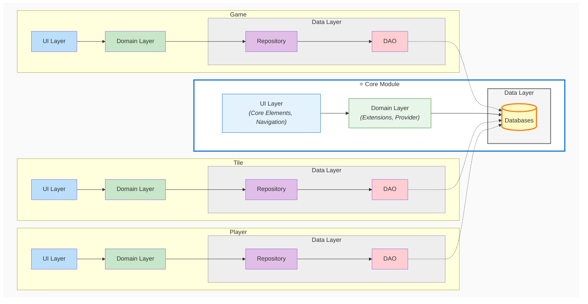
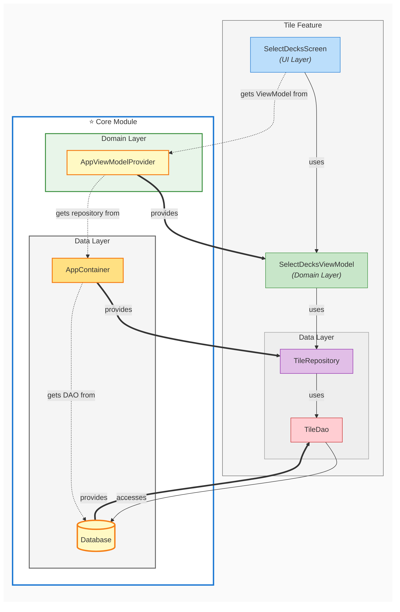
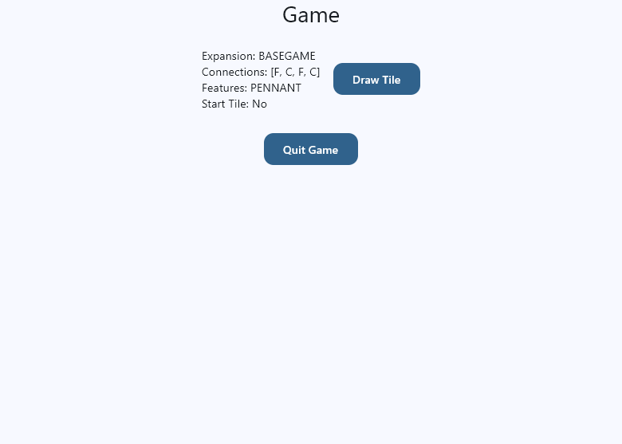
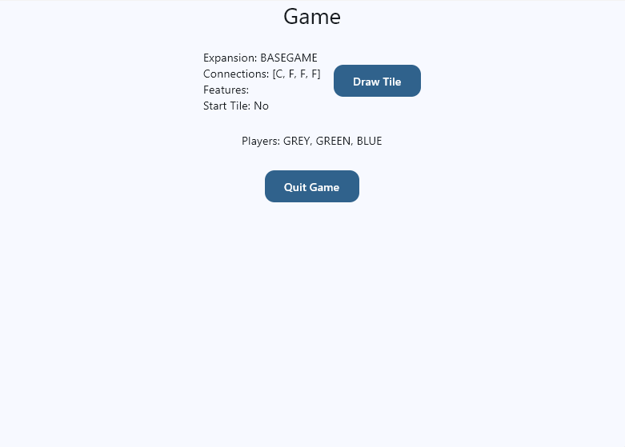

# Task 2: Persist and Manage Game State

In the last task, we introduced the domain layer to our selection screens and moved state and business logic out of the UI layer. However, we still have no mechanism to persist and manage game state across different screens, and we don't initialize anything based on the selections a user makes.

In this task, we'll learn how to connect the domain layer to the data layer to manage and persist game state throughout the app.

## Repositories

A repository acts as an intermediary between the business logic of the domain layer and the more technical data access logic (local or remote databases + DAOs) of the data layer. 

Recall the Vertical Slice Architecture diagram from [Day 1, Task 3](../day1/task3.md) to see how the dependency flow works between the layers and how the repository fits into this structure:



As you can see, the repository is part of the data layer, but it's accessed by the domain layer to perform operations on persistent data objects (e.g., databases). The domain layer doesn't need to know if or how the repository manages local or remote data—it just calls the repository's methods to get or update data as needed. The repository thus abstracts away the details of how data is stored and retrieved, providing a clean API for the domain layer to interact with.

### The Tile Repository

We'll now continue with the preliminary work we did on Day 1 regarding the tile package and connect our already existing `TileDao` to the domain layer by implementing a `TileRepository`. This repository will be responsible for managing all tile-related data operations, such as initializing the draw pile and drawing a tile.

!!! example "Task"
    Add a `TileRepository` class to the `tile.data` package that has a private `TileDao` instance as a dependency that is injected through the constructor.

The dependency injection type we're using here is called **constructor injection**, where dependencies are provided to a class through its constructor. In contrast, the dependency injection type we used for the ViewModels in the last task is called **field injection**.

Now we add the functions for the business logic. To start with, we'll implement a function to initialize the draw pile based on a list of expansions:

```kotlin
package org.example.carcassonne.tile.data

class TileRepository(
    private val tileDao: TileDao
) {
    fun initializeDrawPile(deckNames: List<String>) = tileDao.initialize(
        deckNames.toMutableSet().plus(Expansion.BASEGAME.name.lowercase()).toList()
    )
}
```

We use a list of String for the deck names instead of a list of `Expansion` because we base the available expansions on what's actually stored in the database (i.e., in our `TileDescription.json`) rather than on what could theoretically be available based on the enum class.

We also make sure to always include the base game expansion as a default in the draw pile, even if it wasn't explicitly selected.

Next, we add a property with private setter for the current size of the draw pile:

```kotlin
class TileRepository(
    private val tileDao: TileDao
) {
    var pileSize: Int = 0
        get() = tileDao.count()
        private set
    
    fun initializeDrawPile(deckNames: List<String>) = tileDao.initialize(
        deckNames.toMutableSet().plus(Expansion.BASEGAME.name.lowercase()).toList()
    )
}
```

Now we can add a function to draw a random tile from the draw pile:

```kotlin
fun drawTile(): Tile? {
    if(pileSize > 0){
        return tileDao.popAt(Random.nextInt(0, pileSize))
    }
    println("No tile left to draw.")
    return null
}
```

Note that in all the functions and properties we've added, we only rely on what the `TileDao` provides and don't care about how it accesses the data.

!!! example "Task"
    Now it's your turn: Add the following functions and properties to the `TileRepository` using just the `TileDao`:

    - A function `drawStartTile(): Tile?` that returns the starting tile
    - A function `clear()` that empties the draw pile
    - A property `availableDecks: List<String?>` that returns a list of all available decks based on the tile descriptions stored in the database

### Use the Tile Repository to initialize the draw pile

Go back to the `SelectDecksViewModel` and add a private `TileRepository` instance as a constructor dependency (just like you did with the `TileDao` before).

Add the following function to the `SelectDecksViewModel` that initializes the draw pile based on the selected decks:

```kotlin
fun useDecks() {
    tileRepository.initializeDrawPile(_uiState.value.selectedDecks)
}
```

Then replace the hardcoded list of available decks:

```kotlin
val availableDecks: List<String> = tileRepository.availableDecks.filterNotNull()
```

Also, don't forget to update the initial value of the `selectedDecks` property of the `_uiState` with `Expansion.BASEGAME.name.lowercase()` since the expansion strings from the `TileDescription.json` are serialized in lowercase (cf. the `Expansion` enum).

Now go to the `SelectDecksScreen` to call the `useDecks()` function when the user clicks the "Continue" button. To do this, add arguments similar to `onClickDeck` to inject the function from the ViewModel into the `SelectDecksContent` composable, then add it to the `onClick` lambda (don't forget to adapt the Preview):

```kotlin
Button(
    shape = RoundedCornerShape(12.dp),
    onClick = {
        onContinue()
        navigateToGameScreen()
    }
) { ... }
``` 

## Connect domain layer to data layer with MDI

The last step is to implement a mechanism to manually inject the `TileRepository` dependency into the `SelectDecksViewModel`.

In the framework of MDI, this is done through an **app container**. An app container is a class that's responsible for creating and providing all the repositories of the app—it not only handles dependency injection for the repositories but also helps provide dependencies for the ViewModels. It's usually implemented as a singleton and is part of the core module since it provides dependencies to all features.

Go to the `core.data` package and create an `AppContainer` object. Then add a `tileRepository` property that lazy-initializes the `TileRepository` with the `TileDao` from the database:

```kotlin
object AppContainer {
    val tileRepository: TileRepository by lazy {
        TileRepository(Database.getDatabase().tileDao)
    }
}
```

!!! warning "Attention"
    A DAO is always provided by the database it grants access to, and **never** created manually.

Now switch to the `AppViewModelProvider` and inject the `tileRepository` from the `AppContainer` into the `SelectDecksViewModel`:

```kotlin
initializer {
    SelectDecksViewModel(AppContainer.tileRepository)
}
```

We've now successfully built a complete dependency flow from top to bottom—from the UI layer of the `SelectDecksScreen` down to our pseudo database.

### Dependency Flow

The following diagram illustrates the complete dependency flow from the UI layer down to the database, including how manual dependency injection (MDI) works in our app. Notice how the **AppViewModelProvider** and **AppContainer** act as intermediaries that handle the creation and injection of dependencies:

- **Solid arrows (`-->`)** represent direct usage relationships (e.g., a ViewModel using a Repository)
- **Thick arrows (`==>`)** represent dependency provision (when a component provides/creates an instance for another)
- **Dashed arrows (`-.->`)** represent dependency retrieval (when a component fetches a dependency from a provider)



## Test that data is persisted across screens

To test that our draw pile is actually initialized and persists across screens, we'll add some temporary elements to the `GameScreen` that display information about the currently drawn tile and provide a button to draw a tile from the pile.

To achieve this, we need to add a `GameViewModel` that also has the `TileRepository` injected as a dependency, then use this ViewModel in the `GameScreen` to call the `drawTile()` function and display the drawn tile's information through the `uiState`.

!!! example "Task"
    Add a `GameViewModel` to the `game.domain` package and implement it. It needs a dependency on the `TileRepository` and should implement functions to draw a tile and update the UI state. The `_uiState` should be of a custom `GameUiState` type that contains a property for the currently drawn tile. Add this type as a data class in the same file below the `GameViewModel`.<br>
    Next, register the `GameViewModel` in the `AppViewModelProvider` and inject the `TileRepository` from the `AppContainer`. Finally, use the `GameViewModel` in the `GameScreen` to add a button that draws a tile and displays its information using the provided TileTester composable below.

Use the following simple TileTester composable to display the drawn tile's information:

```kotlin
@Composable
fun TileTester(
    currentTile: Tile? = null,
    drawTile: () -> Unit
) {
    Row(
        modifier = Modifier
            .fillMaxWidth()
            .padding(horizontal = 16.dp),
        horizontalArrangement = Arrangement.Center,
        verticalAlignment = Alignment.CenterVertically
    ) {
        Column(
            horizontalAlignment = Alignment.Start
        ) {
            if (currentTile != null) {
                Text(
                    text = "Expansion: ${currentTile.expansion}",
                    style = MaterialTheme.typography.bodyMedium
                )
                Text(
                    text = "Connections: [${currentTile.connections.joinToString(", ")}]",
                    style = MaterialTheme.typography.bodyMedium
                )
                Text(
                    text = "Features: ${currentTile.features.joinToString(", ")}",
                    style = MaterialTheme.typography.bodyMedium
                )
                Text(
                    text = "Start Tile: ${if (currentTile.start) "Yes" else "No"}",
                    style = MaterialTheme.typography.bodyMedium
                )
            } else {
                Text(
                    text = "No tile drawn yet",
                    style = MaterialTheme.typography.bodyMedium
                )
            }
        }

        Spacer(modifier = Modifier.width(16.dp))

        Button(
            shape = RoundedCornerShape(12.dp),
            onClick = drawTile
        ) {
            Text("Draw Tile")
        }
    }
}
```

Start the app and test that you can draw random tiles from the initialized draw pile and that the information about the drawn tile is displayed correctly. It should look like this:



## Connect the Select Players Screen to the data layer

We already created a ViewModel for the `SelectPlayersScreen` in [Task 1](task1.md), but we haven't yet connected it to the data layer. In fact, our pseudo database doesn't even have a DAO or table for player-related data yet. However, you've learned to implement all the necessary objects and mechanisms to do so in the previous sections, so now it's your turn to add a table to the pseudo database, implement a `PlayerDao`, a `PlayerRepository`, and connect the `SelectPlayersViewModel` to the `PlayerRepository` through the `AppContainer` and `AppViewModelProvider`.

!!! example "Task"
    Implement the data layer for the `SelectPlayersScreen` and connect it to the domain layer.
    
    - Add a player table of type `MutableMap<PlayerColor, Player>` to the pseudo database (we implemented the `Player` data class already on Day 1, so you can just use it)
    - Add a `PlayerDao` to the `player.data` package and implement the following functions:
        - `insert(player: Player)`
        - `delete(player: Player)`
        - `update(player: Player)`
        - `deleteAll()`
        - `getAllPlayers(): List<Player>`
        - `getPlayer(playerColor: PlayerColor): Player?`
    - Add the `PlayerDao` to the `Database` class and initialize it in the `init` block
    - Add a `PlayerRepository` to the `player.data` package and implement the following functions:
        - `addPlayer(playerColor: PlayerColor)`
        - `addPlayers(playerColors: List<PlayerColor>)`
        - `getPlayers(): List<Player>`
        - `getColors(): List<PlayerColor>`
        - `removeAllPlayers()`
    - Add the `PlayerRepository` to the `AppContainer` and inject the `PlayerDao` from the database
    - Add the `PlayerRepository` as a dependency to the `SelectPlayersViewModel` and implement a function `setUpPlayers()` that initializes the player table based on the selected player colors
    - Inject the dependency in the `AppViewModelProvider`
    - Finally, call the `setUpPlayers()` function in the `SelectPlayersScreen` when the user clicks the "Continue" button (similar to how you called the `useDecks()` function in the `SelectDecksScreen`)

### Test that the player data is persisted across screens

To test that the selected players are actually initialized and persist across screens, we can add a simple Text composable to the `GameScreen` that displays the selected player colors. To achieve this, we need to add a dependency on the `PlayerRepository` to the `GameViewModel`, then use this repository to add a function `getColors(): List<PlayerColor>` to the `GameViewModel` that returns the list of selected player colors. This function can then be called from the `GameScreen` to display the player colors through a Text composable. It should look something like this:



## Summary

In this task, you connected the domain layer to the data layer by implementing repositories that act as intermediaries between ViewModels and DAOs. You learned how to use the AppContainer to manage repository dependencies and provide them to ViewModels through the AppViewModelProvider. By implementing the TileRepository and PlayerRepository, you saw how the repository pattern abstracts data access details and provides a clean API to the domain layer. Finally, you tested the complete dependency flow from UI to database, confirming that game state persists correctly across screens.

In the next task, you'll learn how to implement more complex frontend elements based on a Figma design. 

---

[Previous: Task 1](task1.md) | [Next: Task 3](task3.md)