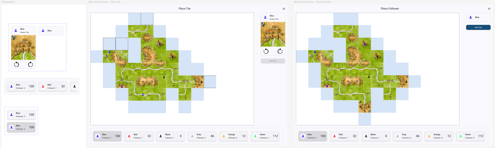
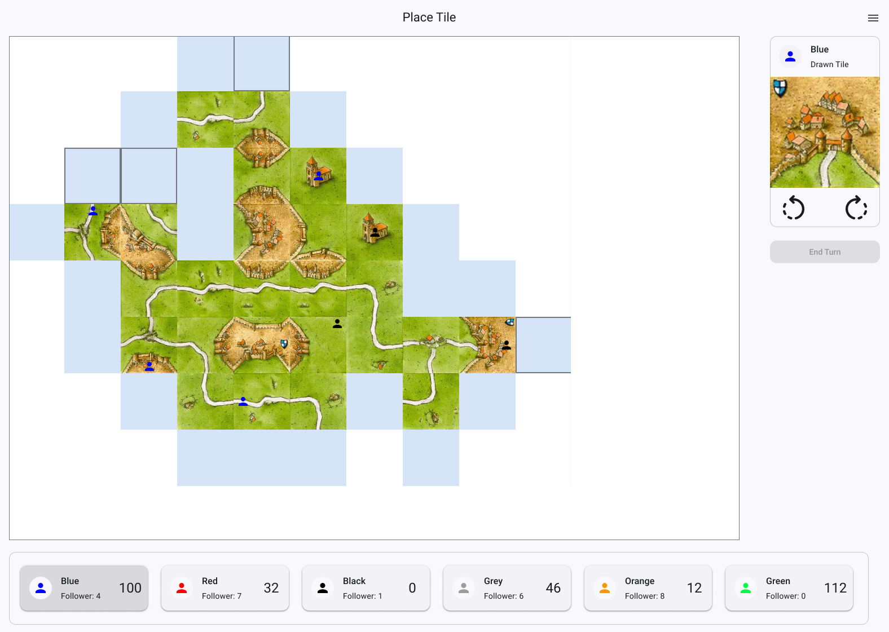
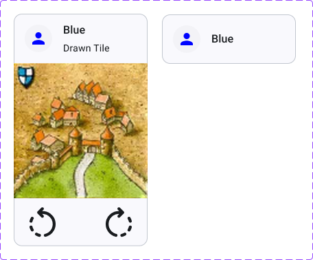
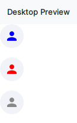
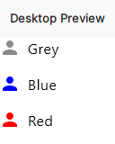
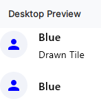
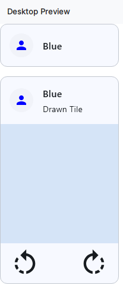
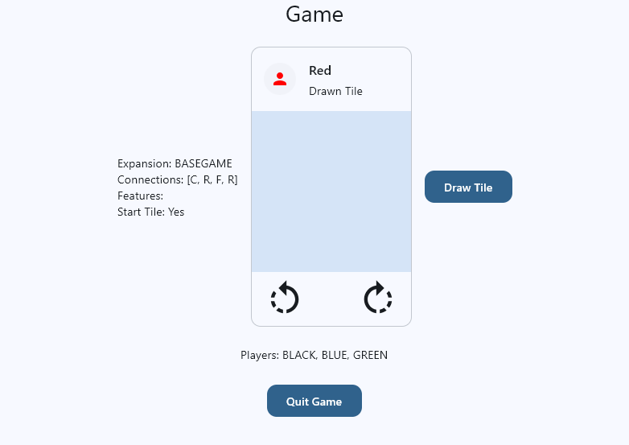
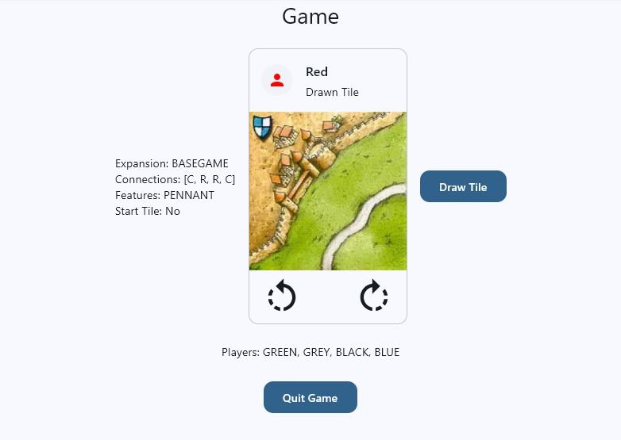

# Task 3: Building a Tile Card

In this task, you'll build a frontend element based on the specifications of a UI designer who created the design in Figma. More precisely, you'll build a control element that shows whose turn it is and what the current tile is.

## The Figma Design

Let's assume you or another UI designer created a design for the game screen in Figma using the [Material Design 3 Design Kit](https://www.figma.com/community/file/1035203688168086460). One of the layers the UI designer might be working on could look like this:



Here you can see custom components on the left and two different states of the GameScreen next to them. For example, in the middle you can see how it's supposed to look when it's the blue player's turn to place the card.



Note the blue squares that indicate all possible placements of cards in general, with outlines showing where the current tile in the current orientation could be placed. We'll come back to this tomorrow when we build the game screen. For now, we'll focus on building the tile card component shown in the top right corner of the screen and in the custom components section.



The component has two so-called *variants* in Figma, which means the UI designer created two different states of the same component: one for when the tile is just drawn and waiting to be placed, and one for after the tile has been placed.

Your task is to implement this component exactly as it's designed and add it to the GameScreen. However, you won't need to implement any logic regarding rotation or placement—that will come tomorrow.

## The implementation

### The TileCell texture drawer

The first thing we'll need is a composable that draws the texture—the element of the Tile Card that shows the tile's appearance. Go to the `Elements.kt` file of the `tile.presentation` package. There you'll find a commented out composable called `TileCell` that came with the project.

Uncomment everything, including the preview. You'll notice that the preview calls a factory function `Tile.getEmpty()` that isn't yet implemented. Go to the definition of `Tile` and add a companion object to the data class that implements the `getEmpty(): Tile` function. This function returns an instance of `Tile` where the mandatory fields are set to empty defaults like `listOf()`. For the `areas` field, use another factory function `Areas.getEmpty()` that you also need to implement in the `Areas` data class. Implement it like the `Tile.getEmpty()` function, with empty lists using `listOf(listOf())`.

Head back to the `TileCell` composable and run the preview. You should see a blue square. Set the tile property to `null` and run the preview again. You should see nothing. This is the expected behavior, since the `TileCell` should only be visible when an actual `Tile` instance is provided. If a Tile is provided, the `TileCell` draws the tile's texture if it has any. If the tile has no texture (like with the Tile instances in our pseudo database currently), the `TileCell` just shows a default blue background.

### The Current Player Badge

Next, we need an element that draws the round player badge in the top left corner of the tile card, displaying the current player's color. When implemented, it should look like this:



!!! example "Task"
    Implement the `CurrentPlayerBadge` composable as specified in the Figma design. It should take the following parameters:

    - `modifier: Modifier = Modifier`
    - `currentPlayerColor: PlayerColor`
    - `backgroundColor: Color = MaterialTheme.colorScheme.surfaceContainerLow`


#### Tip: Multiple Previews

To show multiple versions of your composable in the preview (like above, where we can see three different versions of the `CurrentPlayerBadge` with different colors), you can simply put multiple calls to the composable in the same preview function wrapped in a Column. For example, test the following for the `SelectColorRowPreview` that we implemented yesterday:

```kotlin
@Preview
@Composable
fun SelectColorRowPreview() {
    AppTheme {
        Column(verticalArrangement = Arrangement.spacedBy(16.dp)) {
            SelectColorRow(playerColorString = PlayerColor.GREY.name)
            SelectColorRow(playerColorString = PlayerColor.BLUE.name)
            SelectColorRow(playerColorString = PlayerColor.RED.name)
        }
    }
}
```

It should look like this:



### The Current Tile Header

Now that we have the Current Player Badge, we can continue with implementing the header. Recall the Figma design of the tile card:


The header is the part of the card above the tile texture (i.e., the `TileCell`), which consists of the current player badge and two text elements next to it: one for the color and one for "Drawn Tile". When the tile is placed, the second text disappears and the color text realigns to the center of the header. This means when implemented, the header should look like this depending on the state of the tile:



!!! example "Task"
    Implement the `CurrentTileHeader` composable as specified in the Figma design. It should take the following parameters:
    
    - `modifier: Modifier = Modifier`
    - `currentPlayerColor: PlayerColor`
    - `tilePlaced: Boolean = false`

### The Current Tile Card

Now we can put everything together and implement the `CurrentTileCard` composable that represents the whole card as shown in the Figma design. When implemented, it should look like this depending on the state of the tile:



!!! example "Task"
    Implement the `CurrentTileCard` composable as specified in the Figma design. It should take the following parameters:

    - `modifier: Modifier = Modifier`
    - `tile: Tile?`
    - `currentPlayerColor: PlayerColor`
    - `onRotateLeft: () -> Unit`
    - `onRotateRight: () -> Unit`

    Use the `CurrentTileHeader` and `TileCell` composables you implemented in the previous steps to build the `CurrentTileCard`. Use `IconButton` for the rotate buttons and use the `RotateLeft` and `RotateRight` icons from Material Design Icons. The rotate buttons should only be visible when a tile is provided (i.e., when the `tile` parameter is not null) and call the `onRotateX` functions.

### Adding the Tile Card to the Game Screen

To test that your `CurrentTileCard` works as expected, you can add it to the `GameScreen`:



!!! example "Task"
    Put the `CurrentTileCard` somewhere in the `GameScreen` composable and inject the current tile. You can use default values for the `currentPlayerColor` and the `onRotateX` functions for now.

### Add the textures

Finally, we can add the textures from the `CarcassonneTiles.jpg` file in the resources to the `Tile` instances in the pseudo database.

Go to the `Database` class and add the following code block to `initializeTileSource()` **below** the JSON loader:

```kotlin
//read tile textures and add to library
this::class.java.getResourceAsStream("/CarcassonneTiles.jpg")?.let { stream ->
    val rawTextures: BufferedImage = ImageIO.read(stream)
    val tilePixelHeight = rawTextures.height / TILE_TEXTURE_TILES_PER_COLUMN
    val tilePixelWidth = rawTextures.width / TILE_TEXTURE_TILES_PER_ROW
    val tileTextures: MutableList<BufferedImage> = mutableListOf()
    for (y in 0 until TILE_TEXTURE_TILES_PER_COLUMN) {
        for (x in 0 until TILE_TEXTURE_TILES_PER_ROW) {
            val tileTexture = BufferedImage(tilePixelWidth, tilePixelHeight, BufferedImage.TYPE_INT_RGB)
            val textureDrawer = tileTexture.createGraphics()
            textureDrawer.drawImage(
                rawTextures,
                //target size
                0, 0, tilePixelWidth, tilePixelHeight,
                //source snipping size and place
                x * tilePixelWidth, y * tilePixelHeight, (x + 1) * tilePixelWidth, (y + 1) * tilePixelHeight,
                null
            )
            textureDrawer.dispose()
            tileTextures.add(tileTexture)
        }
    }
    tileCollection.zip(tileTextures).forEach { (tile, texture) ->
        tile.texture = texture
    }
}
```

Add the missing constants to the `Contants.kt` file. Which values do they need to have?

Restart the aplication. You should now see the textures on the tile card instead of the blue background:



Click the "Draw Tile" button several times and check that the metadata shown on the left corresponds to the texture.

## Summary

In this task, you built a reusable Tile Card component by decomposing the Figma design into smaller, manageable composables. You learned how to work with UI specifications from designers and implement them precisely using Jetpack Compose. You created the `TileCell` composable to display tile textures using factory functions for empty defaults, implemented the `CurrentPlayerBadge` to show whose turn it is, and built the `CurrentTileHeader` with a stateful layout that adapts when a tile is placed. By combining these components into the `CurrentTileCard`, you created a complete, cohesive UI element that integrates with your existing architecture. Finally, you enhanced the tile data in your pseudo database by loading and mapping tile textures from the `CarcassonneTiles.jpg` resource and verified that the textures display correctly in the UI.

---

[Previous: Task 2](task2.md) | [Next: Summary](summary.md)