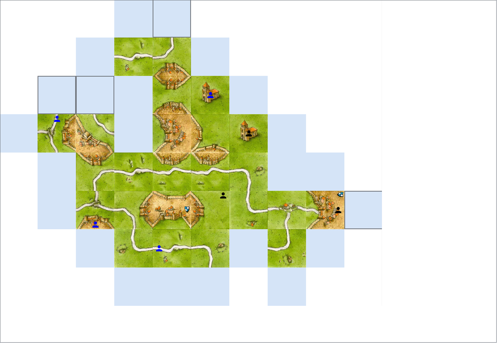
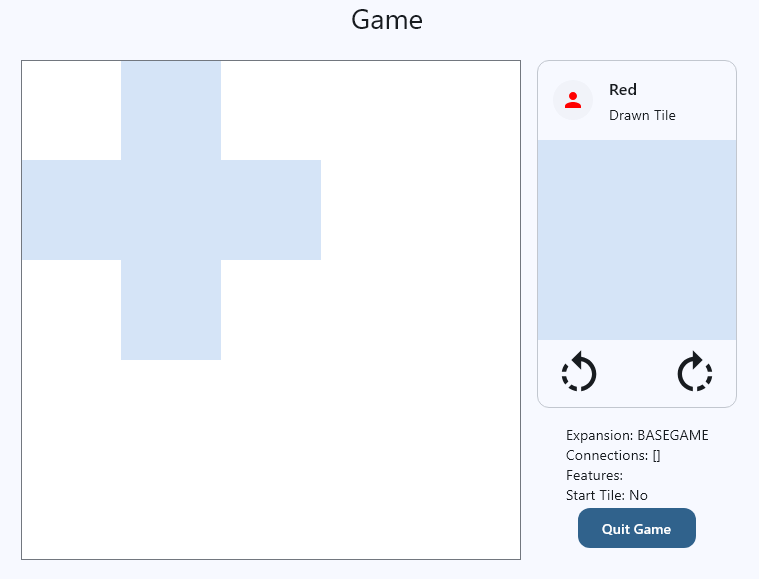
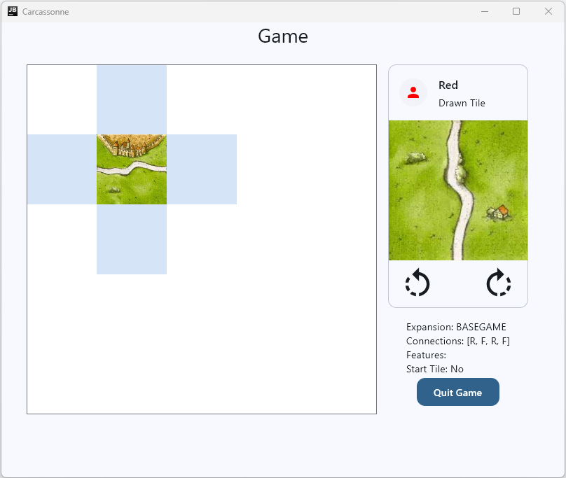

# Task 1: The Tile Board
In this task, we will start to build the most important composable of this app, the game board. It is the part of the running game screen that displays the tile grid and the follower grid, and allows the user to interact with the grids to place tiles and followers.



## The Grid Objects
In this task, you will implement a reusable grid component and use it to create a tile grid for the game.

### Implementing a Reusable Grid Component
When building software you should always strive to create reusable components. This allows you to save time and effort in the future when you need to implement similar functionality. In this task, you will create a reusable grid component that can be used for the tile placement and presentation and also to place followers and show where followers are placed.

!!! example "Task"
    Create a new package `board` and add an open class `Grid` of generic type `T` to the data layer. The class should have constructor attributes for the width and height of the grid plus the default value for all grid cells which is also of type `T`. The class should manage an internal 2D list of the given size and type `T` initialized with the default value. Also, it needs an internal set of active coordinates to track which cells are occupied. Implement the following methods:

    - `set(x: Int, y: Int, value: T)`: Sets the value at the specified coordinates, checks if the coordinates are within bounds. Updates the active coordinates.
    - `get(x: Int, y: Int): T`: Gets the value at the specified coordinates, checks if the coordinates are within bounds.
    - `isWithinBounds(x: Int, y: Int): Boolean`: Checks if the specified coordinates are within the bounds of the grid.
    - `updateActiveCoordinates(x: Int, y: Int)`: Updates the set of active coordinates based on the specified coordinates in the grid, i.e. adds or removes active coordinates.
    - `getActiveCoordinates(): Set<Pair<Int, Int>>`: Returns the set of active coordinates.
    - `activeSize(): Pair<Int, Int>`: Returns the size of the active area as a pair of width and height.
    - `getActiveGridAsList(): List<Pair<Pair<Int, Int>, T>>`: Returns the active area of the grid as a list of pairs, where each pair consists of the coordinates and the value at those coordinates. The active area is defined as the smallest rectangle that contains all active coordinates.
    - `toString(): String`: Returns a string representation of the grid for debugging purposes.

### Building a Tile Grid
Now that you have a reusable grid component, you can use it to build a tile grid for the game. The tile grid is needed to manage the tiles on the game board and enforce placement rules.

!!! example "Task"
    Create a new class `TileGrid` that extends the `Grid` class with the type parameter set to `Tile?`. The `TileGrid` should have a constructor that takes the width and height of the grid as well as a starting tile and initializes the base `Grid` with a default value of `null`. It should have an internal set of permissible coordinates, which are the coordinates where tiles can be theoretically placed (without checking borders or matching edges). The `init` block should set the starting tile in the middle of the grid and update the permissible coordinates accordingly. Implement the following methods:

    - override `set(x: Int, y: Int, value: Tile?)`: Sets the tile at the specified coordinates, checks if the coordinates are within bounds and if the placement is valid according to the game rules (matching edges, not placing on occupied cells). If the placement is valid, it updates the permissible coordinates based on the new tile's edges. Placement of null is allowed and should remove the tile from the grid and update the permissible coordinates accordingly.
    - `matchesConnections(x: Int, y: Int, tile: Tile?): Boolean`: Checks if the tile can be placed at the specified coordinates by comparing its edges with the edges of adjacent tiles.
    - `updatePermissibleCoordinates(x: Int, y: Int)`: Updates the set of permissible coordinates based on the placement of a tile at the specified coordinates. This involves checking the edges of the newly placed tile and determining which adjacent cells become valid for future placements.
    - `updatePermissibleCoordinatesAfterRemoval(x: Int, y: Int)`: Updates the set of permissible coordinates after a tile is removed from the specified coordinates. This involves checking the edges of adjacent tiles and determining which cells become valid or invalid for future placements.
    - `isPermissibleCoordinate(coordinate: Pair<Int, Int>): Boolean`: Checks if the specified coordinate is in the set of permissible coordinates.
    - `getOrNull(x: Int, y: Int): Tile?`: Gets the tile at the specified coordinates or returns null if the coordinates are out of bounds.

## The Game Board Frontend Component
Now that you have implemented the tile grid, you can create a frontend component to visually represent the game board. This component will be responsible for rendering the grids of tiles and followers on the screen, as well as handling user interactions like placing tiles.

### Simple Grid Composable
The first Composable we will build is a simple grid composable that can display a list of composables as a grid given a cell size, grid width and height. This will be a reusable component that we can use to build the tile board and also the follower placement grid later on.

!!! example "Task"
    Create a new Composable function `StaticSimpleGrid` in the `Elements.kt` of the `board` package's presentation layer. It should take a cellSize of type `Dp`, a gridWidth and gridHeight of type `Int`, and a list of composables to display in the grid. The function should use a `Box` with a fixed size based on the cell size for the single cells which contain the composables. The grid should be built using nested `Column` and `Row` composables to create the grid structure. Each cell should display the corresponding composable from the list based on its position in the grid.

Use a preview like the following to test your implementation of the `StaticSimpleGrid`:

```kotlin
@Composable
@Preview
fun StaticSimpleGridPreview() {
    AppTheme {
        StaticSimpleGrid(
            cellSize = 100.dp,
            gridWidth = 3,
            gridHeight = 3,
            content = List(9) {
                {
                    TileCell(
                        modifier = Modifier.size(90.dp),
                        tile = Tile.getEmpty()
                    )
                }
            }
        )
    }
}
```

The smaller size of the `TileCell` compared to the cell size of the grid is intentional to create some visual spacing between the cell contents. You can adjust these sizes as you see fit. The preview should look like this:


### Building the Game Board Composable
Now we will start to build the game board.

!!! example "Task"
    In the presentation layer of the `board` package, create a new file `GameBoard.kt` and implement a `GameBoard` composable that takes in a modifier and a `TileGrid` as parameters. For the background the `GameBoard` composable should use a box with white background and a black border and have a fixed size given by a number of cells. For the beginning, just work with a 5 by 5 cells box. The cells should have a side length of `100 dp`. Inside the box place another box that has the size of the active area of the tile grid. Inside this box place the `StaticSimpleGrid` composable. Generate the content of the `StaticSimpleGrid` using the `getActiveGridAsList()` method of the `TileGrid` to get the list of coordinates and tiles. For each tile, create a `TileCell` composable and set the size of the `TileCell`s to the cell size using the modifier parameter. To distuingish empty cells from permissible cells, check if the coordinate is a permissible coordinate in the `TileGrid` and if it is, show an empty tile (`Tile.getEmpty()`) instead of the tile object from the grid.

Use a preview like the following to test your implementation of the `GameBoard`:

```kotlin
@Composable
@Preview
fun GameBoardPreview() {
    AppTheme {
        GameBoard(
            tileGrid = TileGrid(3, 3, Tile.getEmpty())
        )
    }
}
```

It should look like this:


The grid shows the starting tile as an empty tile in the middle of the cross and the permissible cells as empty tiles in the adjacent cells (that's why it looks like a cross). The other cells are not permissible and are shown as empty spaces, i.e. as white.

### Adding the Proto-Gameboard to the Game Screen

To be able to test the game board and the interaction with it, we will now add the GameBoard composable to the Game Screen. For now, we will just add it to the screen without any interaction, just so that we can see it on the screen and test our implementation.

!!! example "Task"
    In the presentation layer of the `game` package, open the `GameScreen.kt` file and add the `GameBoard` composable to the screen.

There are several ways to do this. The preview of your `GameContent` composable could for example look like this now:



#### Extend the GameViewModel

To fully integrate the game board into the game screen, we will need to extend the `GameViewModel` such that it provides state and functions for the game board.

!!! example "Task"
    In the `GameViewModel.kt` file, add a `GridState` data class similar to the `GameUiState` which holds a `tileGrid` property of type `TileGrid` and a version of type `Long` that can be used to trigger recompositions when the tile grid changes.
    
Remember that in order to trigger recompositions when the tile grid changes we would need to create a complete new instance of the tile grid with the updated values, since otherwise the state would not recognize that the grid has changed (the reference stays the same). This would create a lot of overhead and would not be efficient. Therefore, we use a version property that we increment whenever the grid changes.

!!! example "Task"
    In the `GameViewModel`, add a `gridState` property that holds a StateFlow of type `GridState` similar to the `uiState` but omit the initialization. Instead, add an `init` block to the `GameViewModel` where you initialize the `gridState` with a `TileGrid` of size 5 by 5 and the actual starting tile. Draw the starting tile using the `tileRepository`. Set the version to 0. Also, move the initialization of the `uiState` to the `init` block and initialize it after the `gridState` initialization so that we do not accidentally draw the starting tile.

#### Putting it all together

Now go back to the `GameScreen` and use the `gridState` from the `GameViewModel` to pass the tile grid to the `GameBoard` composable. Start the App and check that everything works. You should see the game board with the starting tile and the permissible cells around it. The `CurrentTileCard` should show the first randomly drawn tile:



## Summary
In this task, you have implemented a reusable grid component and used it to create a tile grid for the game. You have also created a `GameBoard` composable that visually represents the game board and added it to the game screen. Finally, you have extended the `GameViewModel` to provide state for the game board. In the next task, we will implement the functionality to rotate and place tiles on the game board.


---

[Previous: Day 4 Overview](../index.md) | [Next: Task 2](task2.md)