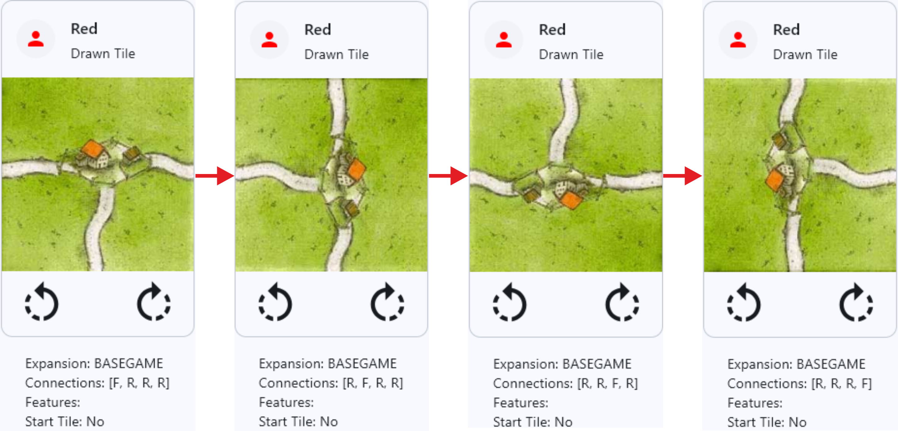
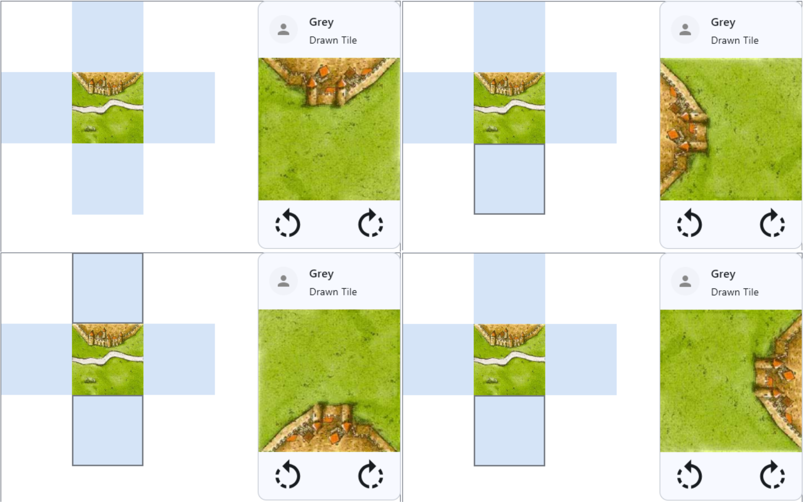
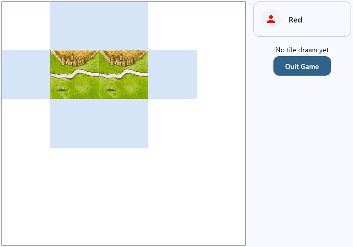

# Task 2: Rotate and Place Tiles

In this task, we will implement the functionality to rotate and place tiles on the board according to the game rules.

## Rotate Tiles
Rotating a tile means rotating it in 90-degree increments, so-called quadrant rotations. Therefore, every tile can be placed in four different orientations. We already have rotation buttons in our `CurrentTileCard` component, but they are not functional yet, since no function is triggered when clicking them. The functions we need here should be provided by the domain layer, i.e., the `GameViewModel`.

!!! example "Task"
    Implement two dummy functions, `rotateCurrentTileLeft` and `rotateCurrentTileRight`, in the `GameViewModel` and connect them to the rotation buttons in the `CurrentTileCard` shown in the `GameScreen`. You can just print a log message in the dummy functions for now; we will implement the actual rotation logic in the next task.

Start your application and check if the log messages are printed when you click on the rotation buttons.

To implement the rotation logic, we add an extension function `getTileRotatedBy(quadrantRotations: Int): Tile` to the `Tile` class. This function takes the number of quadrant rotations as an argument and returns a new `Tile` instance that is rotated accordingly. The `Tile` class has 3 properties that need to be considered: `connections`, `areas`, and `texture`.

!!! example "Task"
    Implement the `getTileRotatedBy` function in the `Tile` class by rotating the `connections`, `areas`, and `texture` properties according to the number of quadrant rotations. Implement fitting extension functions for `Enum` types and `List<List<Enum>>` types (i.e., your areas). For the texture, which is a `BufferedImage`, you may add a free function that uses the `AffineTransform` class from the Java AWT library to perform the rotation.

Finally we need to use our tile rotation logic in the `GameViewModel`. In the `rotateCurrentTileLeft` and `rotateCurrentTileRight` functions, we can call the `getTileRotatedBy` function on the current tile in our game state with the appropriate number of quadrant rotations (1 for right rotation, 3 for left rotation) and update the game state with the rotated tile.

Use the following function to update the current tile in the game state:

```kotlin
private fun updateCurrentTile(tile: Tile? = null) {
    _uiState.update {
        it.copy(
            currentTile = tile,
        )
    }
}
```

Test your implementation by rotating a tile in the `CurrentTileCard` and checking if the tile is rotated correctly. Check not only the texture but also the connections and areas of the tile to ensure that they are rotated correctly as well.

Example of three consecutive clockwise rotations of a tile:



## Check Possible Tile Placements

Next, we need a mechanism to check where a tile can be placed on the game board given its current orientation. Look at the following example from the finished game:



As you can see, the game board indicates where no tile can be placed (white cells), where a tile can be theoretically placed (light blue cells), and where the current tile can actually be placed given its orientation (light blue cells with thick borders). The latter cells are also the only ones that are clickable and allow the player to place the tile in its current orientation into that specific cell.

We have already implemented the behaviour of the light blue cells (_permissible cells_) in the `TileGrid`, so this works already.
Also, we have already implemented a `matchesConnections` function in the `TileGrid` that checks whether the given tile is connection-compatible with all existing neighbors in the grid. We can use this function to create the interaction layer for our game board that provides the clickable cells for tile placement.

Go to the `GameBoard` composable. In a previous task, we added the `StaticSimpleGrid` composable that statically displays the current tile grid in the `GridState` of our running game. Now we will add an interaction layer on top of this static grid that allows the player to click on the cells where the current tile can be placed. This interaction layer uses the same `StaticSimpleGrid` composable. Remember that in a `Box` composable (i.e., the container in which we placed our `StaticSimpleGrid`), the children are drawn on top of each other in the order they are declared. So if we declare the interaction layer after the static grid, it will be drawn on top and can be used to capture click events.

!!! example "Task"
    Implement the interaction layer in the `GameBoard` composable that sits on top of the static grid that displays the current tile grid. The interaction layer should only be rendered if the game is currently in the tile placement step (and not during other steps like the follower placement step which will come later). Add the attribute `tilePlacementStep: Boolean = true` to the `GameUiState` data class to keep track of whether we are currently in the tile placement step or not and inject `uiState: GameUiState` to the `GameBoard` composable. Also, replace the `tileGrid: TileGrid` parameter of the `GameBoard` with `gridState: GridState`, which contains the `TileGrid` as well as other information that we will need later on.
    The interaction layer should have the following behaviour:

    - If the current tile is not null and the cell we are currently testing is an empty TileCell, we check if the current tile can be placed in that cell by using the `matchesConnections` function of the tile grid in our `GridState`. If the tile can be placed, we render a `TileCell` composable with `tile = null` that has a 2 dp thick border with the `outline` color from our theme.
    - In all other cases, we render a `TileCell` composable with `tile = null` that has no border.

    Don't forget to set the `TileCell` composables to the correct size.

After you have completed the task and put everything together, start your application and check if the interaction layer is working as expected. Rotate the current tile and check whether the correct cells are highlighted as possible placement options.

## Place Tiles

Finally, we need to implement the actual tile placement logic. This means that when the player clicks on a cell in the interaction layer that is highlighted as a possible placement option, the current tile should be placed in that cell and the game state should be updated accordingly.

Right now, the interaction layer only highlights the possible placement options, but does not capture click events yet. To make the `TileCell` composables in the interaction layer that indicate placement cells clickable, we can add a `clickable()` modifier to them, which triggers a placement function from the `GameViewModel` that takes the coordinates of the clickable cell.

!!! example "Task"
    Implement the function `placeTileAt(x: Int, y: Int)` in the `GameViewModel` that takes the coordinates of the cell where the player wants to place the current tile and does the following:

    - updates the grid state with the new tile (use the provided function below)
    - sets the current tile to null (use the provided `updateCurrentTile` function)
    - sets the `tilePlacementStep` property of the `GameUiState` to `false`

Use the following function to update the grid state with the new tile:

```kotlin
private fun updateGridStateWithNewTileAt(x: Int, y: Int) {
    _gridState.update {
        it.tileGrid.set(x, y, uiState.value.currentTile)
        it.copy(
            version = it.version + 1
        )
    }
}
```

As mentioned before, we do not replace the tile grid in our grid state but instead directly mutate it by calling the `set` function of the `TileGrid` class and then trigger a state update by increasing the version number of the grid state.

Start the application and test if the tile placement logic is working as expected. Rotate the current tile and click on a highlighted cell to place the tile. It should look something like this:



### Test continuously placing tiles

To test the tile placement logic more thoroughly, you may want to continuously place tiles on the game board. To do this, you can temporarily modify the `placeTileAt` function to automatically draw a new tile after placing the current tile and leave the `tilePlacementStep` as true so that the interaction layer is still active. 

Also, you will need to initialize the `TileGrid` in the `GridState` to the maximum possible width and height according to the size of your draw pile, so that you can place all the tiles from the draw pile on the game board without running into out-of-bounds issues. You can use the `pileSize` property of the `TileRepository` for this.

```kotlin
val gridLength = 2 * tileRepository.pileSize - 1
```

and use this length for both dimensions of your tile grid.

You might notice that after placing a few tiles, the game board composable is not big enough to show all placed tiles. We will fix this and many other UI-related topics in the next task.

## Summary

In this task, we implemented the tile rotation and placement logic of our Carcassonne game. We implemented the `getTileRotatedBy` function in the `Tile` class to rotate a tile by a given number of quadrant rotations and used this function in the `GameViewModel` to rotate the current tile when the player clicks the rotation buttons. We also implemented an interaction layer on top of our static tile grid in the `GameBoard` composable that highlights the cells where the current tile can be placed according to its current orientation and allows the player to click these cells to place the tile on the game board. Finally, we implemented the `placeTileAt` function in the `GameViewModel` that updates the game state with the new tile placement.

In the next task, we will work on the UI of our game screen and make it more visually appealing and usable. 

---

[Previous: Task 1](task1.md) | [Next: Task 3](task3.md)