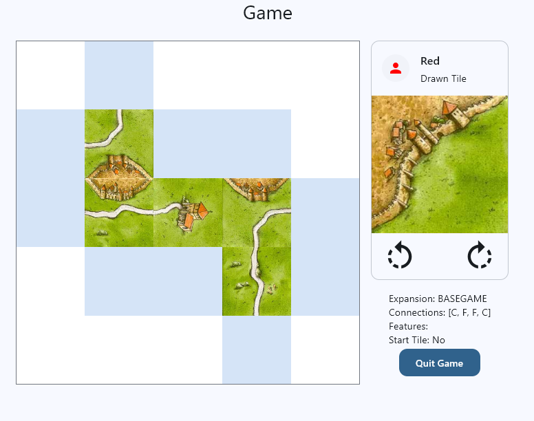
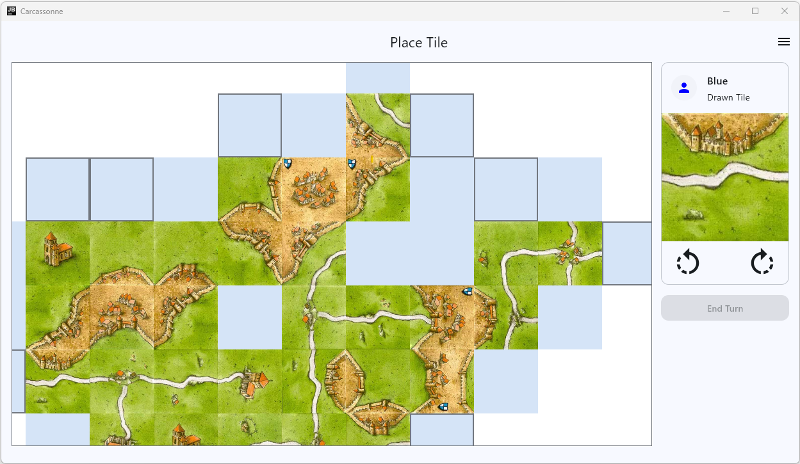
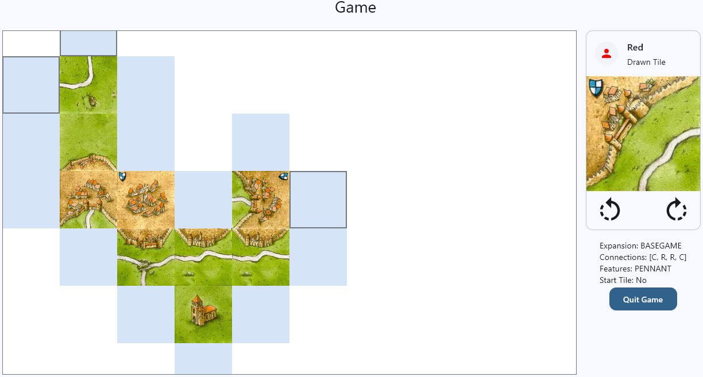
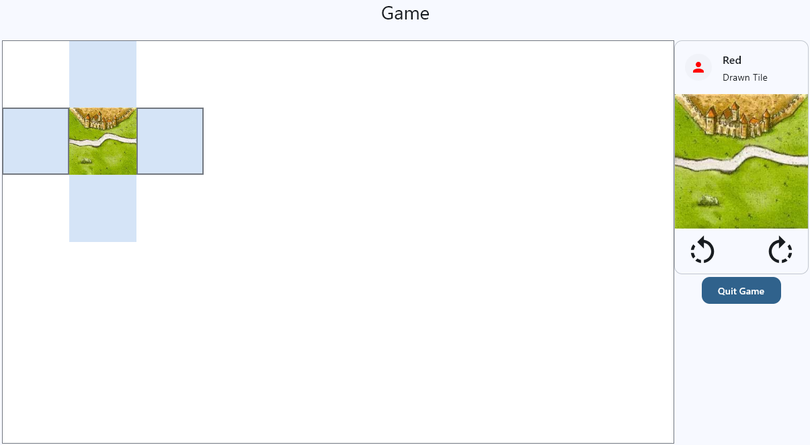
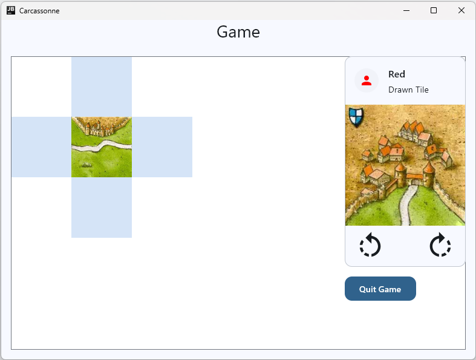
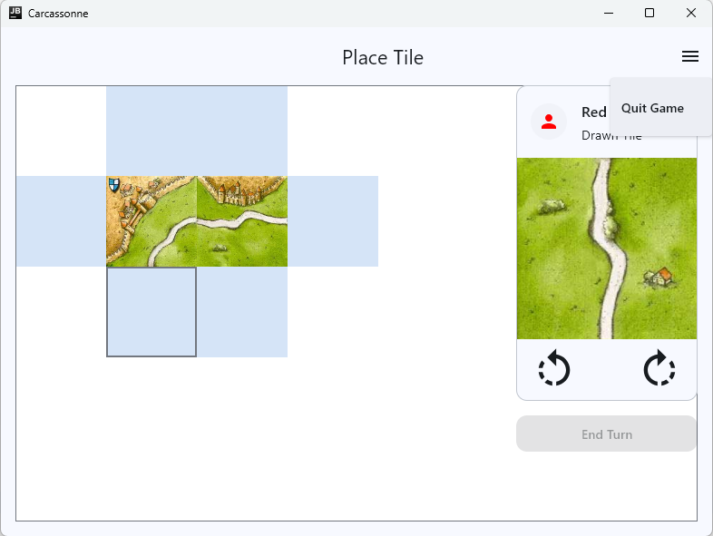
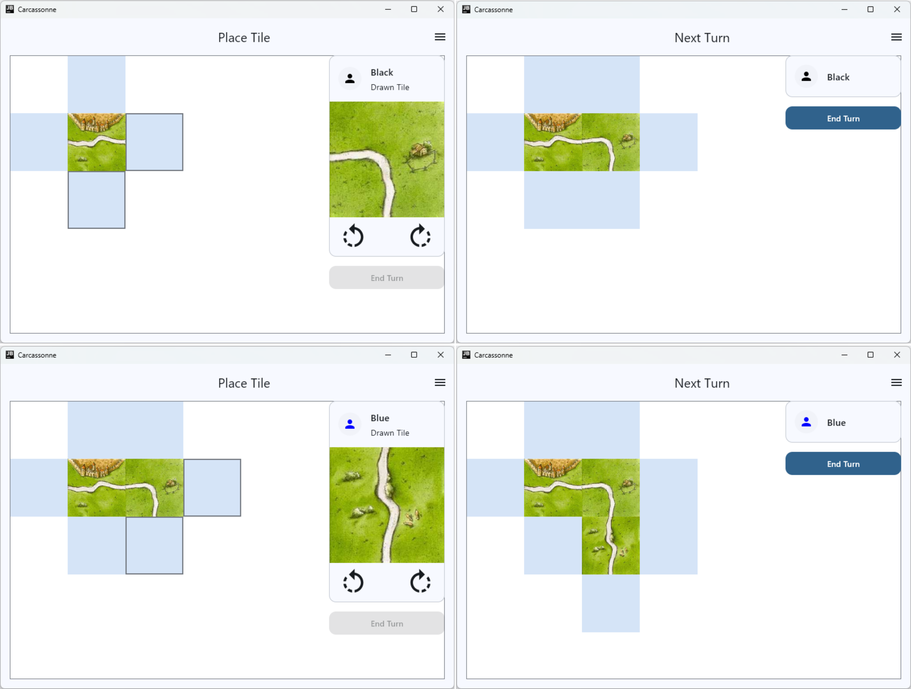

# Task 3: Building the Game Screen

Right now, your game screen should look something like this:



It allows you to rotate and place tiles, while automatically drawing a new tile from the pile after every placement. However, the game board still cannot show tiles beyond its edges, and the turn order does not advance to the next player yet.

In this task, we will fix all these issues while making the game screen in general more visually appealing.

In the end, we want to have a game screen that looks like this:



## Making the Game Board Bigger and Draggable

First, we will make the game board bigger and draggable, so that players can move the content of the board as soon as it extends beyond the board's edges.

Go to your `Elements.kt` file inside the board package and add the following composable:

```kotlin
@Composable
fun DraggableBox(
    modifier: Modifier = Modifier,
    cellSize: Dp,
    gridWidth: Int,
    gridHeight: Int,
    content: @Composable () -> Unit
) {
    BoxWithConstraints(
        modifier = modifier
            .clipToBounds()
    ) {
        val boxWidthPx = with(LocalDensity.current) { maxWidth.toPx() }
        val boxHeightPx = with(LocalDensity.current) { maxHeight.toPx() }
        val gridWidthPx = with(LocalDensity.current) { (cellSize * gridWidth).toPx() }
        val gridHeightPx = with(LocalDensity.current) { (cellSize * gridHeight).toPx() }

        val isDraggableX = gridWidthPx > boxWidthPx
        val isDraggableY = gridHeightPx > boxHeightPx

        val minOffsetX = if (isDraggableX) (0.5f * (boxWidthPx - gridWidthPx)) else 0f
        val maxOffsetX = if (isDraggableX) (-0.5f * (boxWidthPx - gridWidthPx)) else 0f
        val minOffsetY = if (isDraggableY) (0.5f * (boxHeightPx - gridHeightPx)) else 0f
        val maxOffsetY = if (isDraggableY) (-0.5f * (boxHeightPx - gridHeightPx)) else 0f

        val offsetX = remember { mutableStateOf(0f) }
        val offsetY = remember { mutableStateOf(0f) }

        Box(
            modifier = Modifier
                .pointerInput(Pair(minOffsetX, minOffsetY)) {
                    detectDragGestures { change, dragAmount ->
                        change.consume()
                        val newOffsetX =
                            (offsetX.value + dragAmount.x).coerceIn(minOffsetX, maxOffsetX)
                        val newOffsetY =
                            (offsetY.value + dragAmount.y).coerceIn(minOffsetY, maxOffsetY)
                        offsetX.value = newOffsetX
                        offsetY.value = newOffsetY

                    }
                }
        ) {
            Box(
                Modifier
                    .offset { IntOffset(offsetX.value.roundToInt(), offsetY.value.roundToInt()) }
                    .wrapContentSize(unbounded = true)
                    .size(cellSize * gridWidth, cellSize * gridHeight)
            ){
                content()
            }
        }
    }
}
```

This adds a custom draggable box composable that we can now use for our game board. It calculates the size of the box and the grid in pixels and allows dragging the content of the box if the grid is bigger than the box itself.

Go to your `GameBoard` composable. There you should have an outer `Box` that defines the size, background, and border of the game board and which wraps around the second `Box` that stacks the different layers of the game board (currently two `StaticSimpleGrid` composables: one for the tile grid and one for the interactive tile placement).

!!! example "Task"
    Replace the outer `Box` with the `DraggableBox`. The modifier can stay the same, but you need to add the `cellSize`, `gridWidth`, and `gridHeight` parameters. Inject the same values that you use for the inner `StaticSimpleGrid` composable. Finally, increase the size of the `DraggableBox` from 5 by 5 tiles to 10 tiles wide and 6 tiles high.

Start the application and make sure that the board has a size of 6*10 tiles and that you can now drag the content of the game board around (but not further than the actual grid size) when it extends beyond the edges of the board.



## Clean up the Game Screen

Before we continue with the player rotation and turn switching, let's quickly clean up the game screen from our legacy test code and make it look and feel a bit nicer.

Go to the `GameScreen` composable. We still have a tile testing composable that we do not need anymore.

!!! example "Task"
    Remove it entirely and replace the component in the game screen with the `CurrentTileCard` directly. Your screen should now look like this:



Next, we want to improve the screen resize and window border behaviour. Currently, the `CurrentTileCard` gets squeezed when the screen is resized to a smaller width. We want to prevent this and instead lay the components on top of each other when the screen is too small. Also the components now extend to the border of the application window, which does not look very nice. We want to add some padding around the components and make sure that they do not extend all the way to the border of the application window:



!!! example "Task"
    In the `GameScreen` composable, replace the innermost `Row`, which contains the `GameBoard` and the `CurrentTileCard`, with a `Box`. Modify the `Box` to fill the maximum size and have 16 dp of padding on the left, right, and bottom. Then, modify the `Column` composable that holds the `CurrentTileCard` and the "Quit Game" button so that it has a fixed width of 200 dp and is aligned to the top end of the box. Also, use a vertical arrangement for the column that puts 12 dp of space between the `CurrentTileCard` and the "Quit Game" button.

Restart the application and make sure that it looks like the screenshot above regarding layering and padding.

## Adding a Top App Bar

Next we want to add a top app bar similar to the ones we have in the option selection screens. However, this one should not have a back button, but instead should have a dynamic title and a settings button that opens a settings dialog when clicked and provides the "Quit Game" option. The old "Quit Game" button will become an "End Turn" button and will only be enabled when the tile has been placed.



Add the following top app bar composable to your core frontend elements and add the necessary string resources:

```kotlin
@OptIn(ExperimentalMaterial3Api::class)
@Composable
fun CarcassonneMainTopBar(
    uiState: GameUiState,
    onQuit: () -> Unit
) {
    var menuExpanded by remember { mutableStateOf(false) }

    TopAppBar(
        title = {
            Row(
                modifier = Modifier.fillMaxWidth(),
                verticalAlignment = Alignment.CenterVertically,
                horizontalArrangement = Arrangement.SpaceBetween
            ) {
                Spacer(modifier = Modifier.weight(1f))
                Text(
                    modifier = Modifier.weight(1f),
                    text = if(uiState.tilePlacementStep){
                        stringResource(Res.string.place_tile)
                    } else {
                        stringResource(Res.string.next_turn)
                    }
                )
                Box{
                    IconButton(onClick = { menuExpanded = true }) {
                        Icon(
                            imageVector = Icons.Default.Menu,
                            contentDescription = "Menu"
                        )
                    }
                    DropdownMenu(
                        modifier = Modifier.align(Alignment.TopEnd),
                        expanded = menuExpanded,
                        onDismissRequest = { menuExpanded = false },
                    ) {
                        DropdownMenuItem(
                            text = { Text(stringResource(Res.string.quit_game))},
                            onClick = onQuit
                        )
                    }
                }
            }
        }
    )
}
```

This composable defines a top app bar with a dynamic title that changes based on the current step in the game and a menu button that opens a dropdown menu with a "Quit Game" option.

!!! example "Task"
    Go to the `GameScreen` composable and replace the current outermost column-row structure which is used to place the title with a Scaffold. Use the `CarcassonneMainTopBar` as the top bar of the scaffold and make sure to use the inner padding values in the `Box` like before (you can stack multiple padding modifiers). Then move the current logic of the "Quit Game" button to the `onQuit` callback of the `CarcassonneMainTopBar`. Then add a string resource for "End turn" and use it in the old "Quit Game" button.
    Finally, stretch the "End turn" button to the full width of the `CurrentTileCard`, remove the `onClick` callback, and only enable it if the current tile in the ui state is null.

Restart the application and make sure that the top app bar is displayed correctly and the inner padding works as expected. Test the menu and make sure that the "Quit Game" option is working as before. Also check that the "End Turn" button spans the full width of the `CurrentTileCard` and is not enabled (since we are currently always in the tile placement step and the current tile is never null).

## Add player rotation logic

Finally, we will add the player rotation logic and make sure that the game screen updates accordingly when the player is switched. First, we will add the business logic to switch the current player and then we will update the game screen accordingly.

!!! example "Task"
    Go to your `GameViewModel` and add the property `currentPlayerColor: PlayerColor` to the `GameUiState` data class. Then, add a private property `playerColors: List<PlayerColor>` and initialize it using the `playerRepository`. Then, update the `init` block to set the `currentPlayerColor` to the first color in the `playerColors` list. After this is done, add the following functions:

    - `private fun updateCurrentPlayer(playerColor: PlayerColor)` which updates the `currentPlayerColor` in the ui state.
    - `private fun nextPlayer()` which calls `updateCurrentPlayer` with the next color in the `playerColors` list.
    - If you have not done so already - add a function `endTurn()` which checks if the current tile is null and if so, draws a new tile, sets the `tilePlacementStep` to true and then calls `nextPlayer`.

Now that we have the business logic ready we can update the frontend to use it.

!!! example "Task"
    Go to the `GameScreen` composable and update the "End Turn" button to call the `endTurn` function when clicked. Also, you might want to remove the `GameContent` composable and instead move its logic directly into the `GameScreen` composable, since the amount of injection is becoming a bit excessive and we do not need the static preview functionality of the `GameContent` composable anymore (we only want to test it dynamically in the running application). Update the injected functions from the `viewModel` accordingly.

Start the application and test that the player rotation and "End Turn" button are working correctly. It should look like this (depending on your screen resize and the number of players):



## Summary

In this task, we have made the game board bigger and draggable, cleaned up the game screen and added a top app bar with a settings menu. Finally, we have implemented the player rotation logic and made sure that the game screen updates accordingly when the player is switched.


---

[Previous: Task 2](task2.md) | [Next: Summary](summary.md)