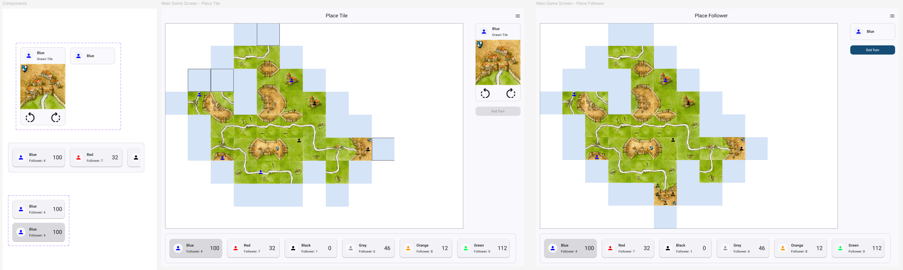
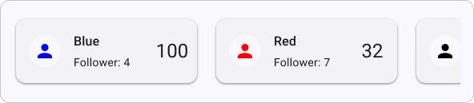
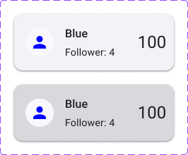
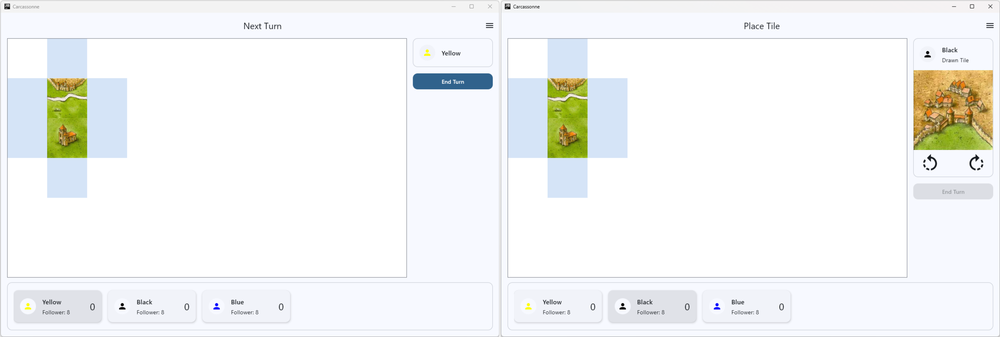
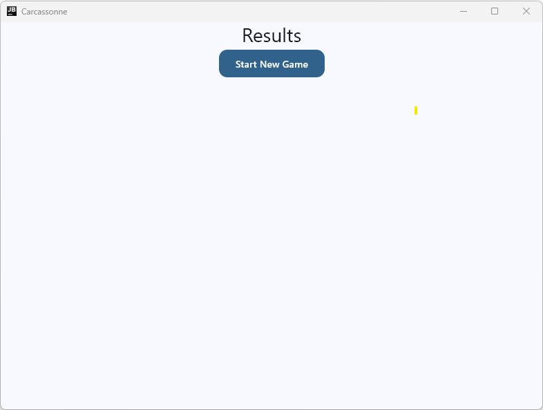
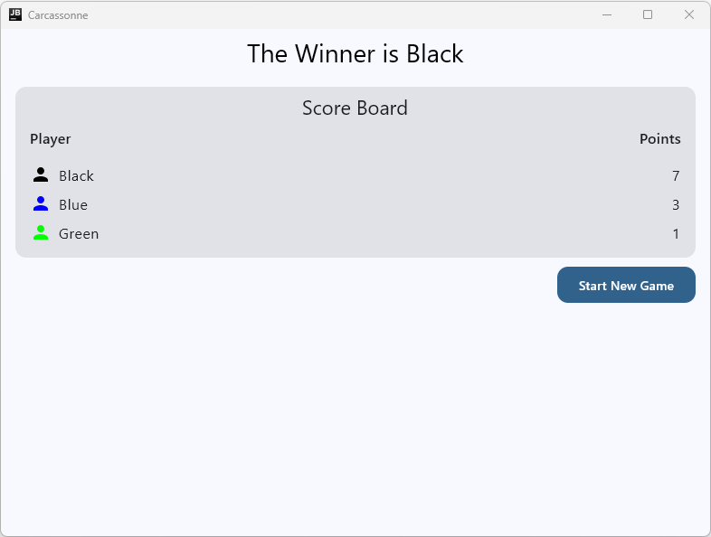
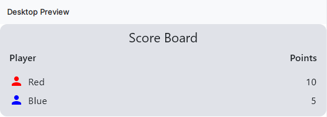

# Task 1: Complete the Game and Result Screens

We'll begin the last day of this course with some final touches to the game screen. Remember the Figma design of the game screen:

As you can see, one major element that is still missing in the implementation is the player information bar at the bottom, which shows the current player's turn, their score, and how many followers they have left. In this task, you'll implement this player information bar and connect it to the game state so it updates correctly as the game progresses.

Afterwards, we will complete the results screen which shows the final scores at the end of the game.

## Player Information Bar

Let's take a look at the Figma design of this component:

The player information bar is a card element that uses another custom card composable that shows the information of a specific player:

The player information card shows the player's color, score, and the number of followers they have left. The card has two states: one for the current player's turn (bottom) and one for the other players (above).

!!! example "Task"
    Add two composables to the `Elements.kt` file of the player package: `PlayerInformationCard` and `PlayerInformationBar`. Use previews to test your components.

    The `PlayerInformationCard` should take in a `Modifier`, a `Player` object, and a boolean indicating whether it is the current player's turn. Use the already implemented `CurrentPlayerBadge` composable for all player badges (you may rename the composable to just `PlayerBadge` if you want, since its use is now more general). Use what you have learned about layout composables, modifiers, spacers, arrangement effects, etc. to implement the given design. Also check the Material Design 3 documentation for the `Card` component to see which type of card you need.

    The `PlayerInformationBar` should take in a `Modifier`, a list of `Player` objects, and the current player's `PlayerColor`. Use a `LazyHorizontalGrid` to display a `PlayerInformationCard` for each player in the list. Make sure to pass the correct boolean to each card to indicate whether it is the current player's turn.

Now that you have implemented the player information bar and card, we need to add it to the game screen and connect it to the domain layer.

But first, we need to add a new state flow to the `GameViewModel` for the players of the game.

!!! example "Task"
    In the `GameViewModel`, add a new private mutable state flow for the list of players in the game. Initialize it using the `playerRepository` to get the list of players. Then add a public state flow that exposes this list of players as an immutable state flow.

You can now continue to add the `PlayerInformationBar` to the `GameScreen` composable and connect it to the flows.

!!! example "Task"
    Add the `PlayerInformationBar` to the `GameScreen` composable. Configure the modifier such that the bar always stays at the bottom left of the screen. Connect the current player's color from the UI state and the list of players from the player state. Collect the player state in the `GameScreen` to do so.

Start the application and test if the player information bar is correctly displayed and updates the current player according to the design:

## Results Screen

Our results screen is currently just a placeholder that does not show any results yet:

In this task, we want to add a score board that shows the final scores of all players at the end of the game or if the game was quit early. The score board should show each player's color and final score, and it should be sorted by score from highest to lowest. Also, the header of the score board should indicate who the winner of the game is. Finally, we will relocate the "Start New Game" button to the bottom right to make the screen look more balanced. In the end, it should look like this:

### The Score Board

We will first add the score board as a separate composable to the results package's `Elements.kt` file. Use the preview functionality to test your composable without needing to connect it to the domain layer. The score board should take in an already sorted list of pairs of player colors and scores and render a score board like this:

### The Results ViewModel

To get a sorted results list in the `ResultsScreen` for our score board we need to retrieve player information from the data layer. Therefore, we need to add a new `ResultsViewModel`.

!!! example "Task"
    Create a new `ResultsViewModel` in the results package's domain layer. The view model should take in the `PlayerRepository` as a dependency and use it to retrieve the list of players, sort it by points, and store it in a `resultList` attribute of type `List<Pair<PlayerColor, Int>>`. Then, go to the `AppViewModelProvider` and add an initializer for the `ResultsViewModel` that provides the `PlayerRepository` as a dependency.

### Finalizing the Results Screen

Now we have the score board composable and the view model to provide the data for it. We just need to connect everything together in the `ResultsScreen` composable and work on the layout to make the `ResultsScreen` look like above shown final design.

!!! example "Task"
    In the `ResultsScreen` composable, add the `ScoreBoard` to the screen and use spacers, padding, arrangement, etc. to achieve the final design shown above.
    
    Then, use the factory to add the `ResultsViewModel` to the `ResultsScreen` and insert the `resultList` from the view model into the `ScoreBoard` to show the final scores of the game.

    Finally, update the header of the score board to indicate the winner of the game as shown. Remember to use string resources instead of hardcoding the text.

Restart the application, select several player colors, and head to the results screen by quitting the game. Since we have not implemented any scoring yet, all players should have 0 points and the winner will be the first player in the list.

## Summary

In this task, you implemented the player information bar that shows the current player's turn, their score, and how many followers they have left. You connected it to the game state so it updates correctly as the game progresses. Then, you finalized the results screen and added a score board that shows the final scores of all players at the end of the game.

In the next task, we will implement a feature to place followers on the board after placing a tile.

---

[Previous: Day 5 Overview](../index.md) | [Next: Task 2](task2.md)