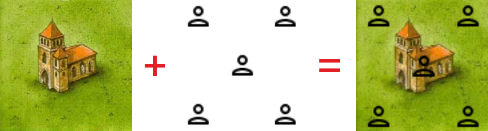
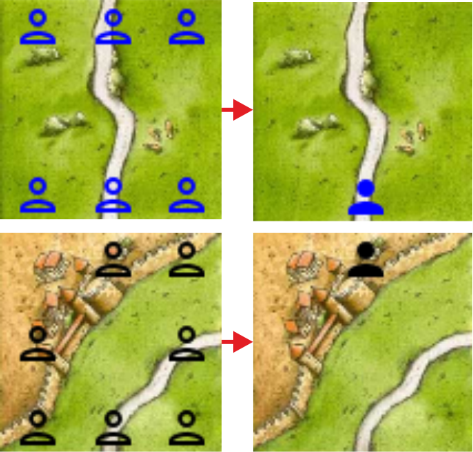
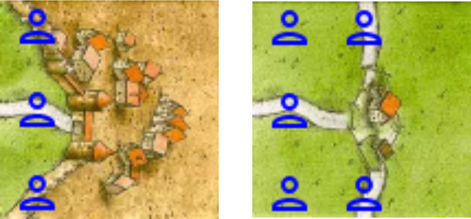
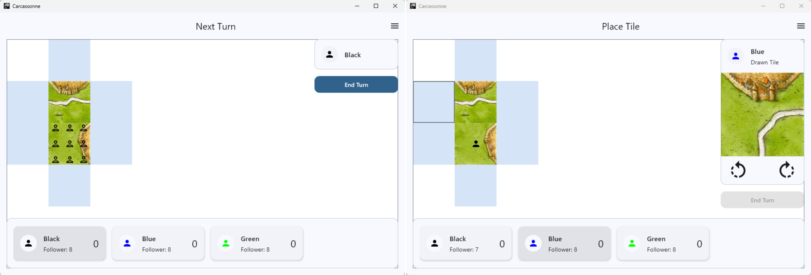
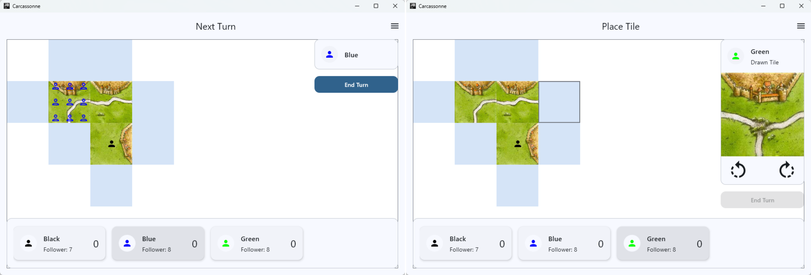
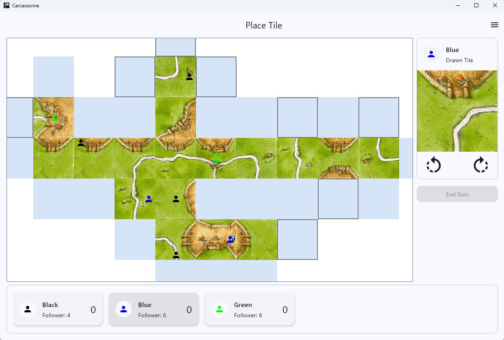

# Task 2: Follower Placement

In this task, we will add a frontend element that allows players to place followers on the board after they have placed a tile. Since we do not have any game logic in place yet that lets us determine where followers can be placed, we will allow players to place followers anywhere on the last placed tile for now. In the next task, we will implement the game logic to determine valid follower placements and scoring.

## The Follower Placement Cell

The idea behind the implementation is to use an additional interaction layer in the game board that uses a grid of follower placement cells. A follower placement cell is rendered on top of the tile grid and displays visual and clickable indicators for where a follower can be placed:



The cell also needs a static state to show where followers have already been placed on the tiles.



In this example a follower was placed on the road (top) and on the city (bottom). 

### Frontend Element

Take a look at the following preview of the follower placement cell that we want to implement:


At the top, you see the follower placement cell in the interactive state, i.e. the "follower placement step" of the turn, where the player can click on one of the given slots to place a follower. A slot is indicated by the outlined `Person` icon. As you can see, a cell can have up to 9 slots, which are arranged in a 3x3 grid. The exact number of slots and their positions depend on the tile that was placed, since followers can only be placed on certain areas of a tile.

At the bottom, you see the follower placement cell in the static state, where it shows where a follower has been placed on a tile. A taken slot is indicated by the filled `Person` icon. In this case, a follower has been placed in the center slot.

Note that, in general, only one follower per tile can exist.

### Placement slots

We need the 9 slots because in Carcassonne, followers can be placed on 9 different areas of a tile: the 4 edges, the 4 corners, and the center.

Go back to the `TileDescription.json` that we implemented on the first day of this course. There, for every tile, we define `areas` that represent the different scoring areas of a tile, i.e. the **roads**, **cities**, and **farms**.
These areas are defined by edges and corners only, where roads and cities are represented by lists of edges and farms are represented by lists of corners. Note that a tile can have several roads and cities. Since the center of a tile is neither an edge nor a corner, **cloisters** are represented as a `feature`.

The following image shows two examples of the placement slots for two different tiles during the game:



In the left picture you can see that the player is allowed to place a follower either on the top left farm, the road or the bottom left farm. The city has already been occupied by a follower, so the player cannot place a follower there. Since there is no cloister on the tile, the center slot is also not available for placement. Here you can see why we need to define the farms as corners, since the west edge effectively has 3 different placement slots.

The picture on the right shows a tile with a three-part road. The player can place a follower either on one of the three roads, i.e. the north, south, or west edge, or on the top-left or bottom-left farm, i.e. the north-west corner or the south-west corner. The right farm is occupied by a follower, so it cannot be placed on.

This example also shows why, even though we define farms through corners, we still need farms in our connection model, which describes what is on the edges (east-edge farm).

## Implementing the Follower Placement Cell

### Prerequisites

Before you can start implementing the frontend elements for follower placement, we need to extend our data model a bit more. First of all, we will add a new package `scoringarea` which will contain all data structures needed to implement the scoring logic. For now, we will just need a data structure `AreaSlot` which represents the different placement slots on a tile.

!!! example "Task"
    Create a new package `scoringarea` and add a subpackage for the data layer. Add a sealed interface `AreaSlot` with the implementation shown below.

The `AreaSlot` sealed interface should have the following implementation:

```kotlin
sealed interface AreaSlot {
    data class EdgeSlot(val edge: Edge) : AreaSlot
    data class CornerSlot(val corner: Corner) : AreaSlot
    data object Cloister : AreaSlot

    companion object {
        val all: List<AreaSlot> = listOf(
            CornerSlot(Corner.NW), EdgeSlot(Edge.N), CornerSlot(Corner.NE),
            EdgeSlot(Edge.W),      Cloister,         EdgeSlot(Edge.E),
            CornerSlot(Corner.SW), EdgeSlot(Edge.S), CornerSlot(Corner.SE)
        )
    }
}
```

This sealed interface defines a data type for the different placement slots on a tile. An `AreaSlot` can either be an `EdgeSlot`, a `CornerSlot`, or a `Cloister`, where the first two use the already defined `Edge` and `Corner` enums to specify which edge or corner they represent.

#### Follower Occupancy Grid

Similar to our tile grid, we will also need a follower occupancy grid that stores the follower occupancy state of the board and can also be used to render the interaction layer for follower placement. First, we will add the `FollowerOccupancy` data structure.

!!! example "Task"
    In the data layer of the `board` package, create a new data class `FollowerOccupancy` that has a property `areaSlotToColor`, which is a map of `AreaSlot` to `PlayerColor?`. Set the default value of this property to a map where all `AreaSlot` values are mapped to `null`, which indicates that no followers are placed on the tile. Use the `slots` property of the companion object below for this.

    Add a companion object to the `FollowerOccupancy` class that has a property `slots` which is a list of all `AreaSlot` and a function `getWith(areaSlot: AreaSlot, playerColor: PlayerColor): FollowerOccupancy` which returns a new `FollowerOccupancy` object with the given `playerColor` set for the given `areaSlot`.

    Finally, add the following two functions to the class:
    
    - `getAreaSlotColorPairs(): List<Pair<AreaSlot, PlayerColor?>>` which returns a list of pairs of `AreaSlot` and the corresponding `PlayerColor?` from the `areaSlotToColor` map.
    - `onlyNull(): Boolean` which returns true if all values in the `areaSlotToColor` map are null, i.e. no followers are placed on the tile.

Now we can create a new grid structure that inherits from our generic `Grid` and uses the `FollowerOccupancy` for the cells.

!!! example "Task"
    Create a new class `FollowerOccupancyGrid` in the `board` package that inherits from `Grid<FollowerOccupancy?>`. The constructor should take in `gridWidth` and `gridHeight` and initialize the grid with `null` values.

    Add an `init` block to the class that sets the initial follower occupancy for the starting tile to a new empty `FollowerOccupancy` object where all slots are set to null.

Note how useful it is to have a reusable `Grid` structure, since we can easily create a new grid for the follower occupancy without needing to implement any grid logic.

### Implementing the Follower Placement Cell

Now that we have all the necessary data structures in place, we can start implementing the follower placement cell. We will implement the cell as a composable that is rendered on top of the tile grid in the `GameBoard`. The cell will use the `FollowerOccupancyGrid` to determine where followers are placed and where they can be placed.

!!! example "Task"
    In the `board` package, create a new composable `FollowerPlacementCell` in the `Elements.kt` file. The composable should take in a `Modifier`, a `FollowerOccupancy` object, an `onClick` function that takes in an `AreaSlot`, a list of takeable `AreaSlot`, and the nullable current player color. Create previews and use them to implement the composable according to the design.

    Use a `LazyVerticalGrid` with 3 columns to render the 9 slots.

    Use a `clickable` modifier for the interactive state to make the takeable slots clickable. When a slot is clicked, call the `onClick` function with the corresponding `AreaSlot`.

    Use the `Person` icon from Material Design Icons for the follower placement indicators as described.

    Don't forget to handle the different states of the cell, i.e. the interactive state where the player can place followers and the static state where it shows where followers are already placed.

### Prepare the Business Logic for Follower Placement

Go to the `GameViewModel` and update our two state data classes.

!!! example "Task"
    Add the follower occupancy grid to the `GridState`. Then, add the following properties to the `GameUiState`:

    - `lastPlacedTileCoordinates` of type `Pair<Int, Int>` which stores the coordinates of the last placed tile. This is needed to determine where to render the interactive follower placement cell.
    - `followerPlacementStep` of type `Boolean` which indicates whether the turn is currently in the follower placement step. This is needed to determine whether to render the interactive follower placement cell layer.
    - `takeableAreaSlots` of type `List<AreaSlot>` which stores the list of takeable area slots for the currently placed tile. This is needed to determine which slots to make clickable in the interactive follower placement cell. Give it a default value of an empty list.

    Align the `init` block accordingly by initializing the new properties and setting the `lastPlacedTileCoordinates` to the coordinates of the starting tile.

To allow for a smooth transition between the tile placement step and the follower placement step, we will need to update the `placeTileAt` function to set the `lastPlacedTileCoordinates` and to set the `followerPlacementStep` to `true` if the current player can place a follower on the placed tile (any slots available, any followers left). Since we do not have any logic yet to determine the takeable slots, we will just set all slots as takeable for now.

Accordingly, we need to update the `endTurn` function because a player may place a follower, but they may also end their turn without placing one. Therefore, we need to set the `followerPlacementStep` to `false` and clear the `takeableAreaSlots` when a turn ends. Also, to keep the follower grid intact, we need to place an empty `FollowerOccupancy` object on the `FollowerOccupancyGrid` at the coordinates of the last placed tile if no followers were placed on the tile during the turn.

!!! example "Task"
    Add a `followerPlaced` boolean parameter to the `GameViewModel` that tracks whether a follower was placed during the turn. Check this parameter in the `endTurn` function and, if no follower was placed, place an empty `FollowerOccupancy` object into the `FollowerOccupancyGrid` at the coordinates of the last placed tile. Add and use a new private function `placeEmptyFollowerOccupancy()` that does exactly this.


Finally, we need a new method in the `GameViewModel` to handle follower placement.

!!! example "Task"
    Add a new function `placeFollowerAt(areaSlot: AreaSlot)` to the `GameViewModel`. This function should update the follower grid with a new `FollowerOccupancy` object that has the given `areaSlot` set to the current player's color. Remember to update the `version` of the grid state to trigger a recomposition of the follower occupancy layer in the `GameBoard`. Also, set the `followerPlaced` parameter to `true` and update the UI state by setting the `followerPlacementStep` to `false` and clearing the `takeableAreaSlots`.
    Finally, remove a follower from the current player's followers (you might need to add a new function in the `PlayerRepository` for this) and refresh the player state to update the player information bar.

### Adding the Follower Placement Cell to the Game Board

Now that we have prepared the business logic for follower placement, we can add two new layers to the `GameBoard` composable: one for the interactive follower placement cells and one for the static follower occupancy cells.

!!! example "Task"
    In the `GameBoard` composable, add a new argument `placeFollowerFun` similar to the `placeTileFun` that we already have. This function should take in an `AreaSlot` and will be called when a player clicks on a takeable slot in the follower placement cell. Then, continue to add two new layers.

    The static follower occupancy layer should be rendered on top of the tile layer but below the interactive layers. It should use the `StaticSimpleGrid` composable to render the follower occupancy state of the board using the `FollowerOccupancyGrid` from the `GameViewModel`. Like before, use the `getActiveGridAsList()` function on the follower grid to implement the `content` lambda for the `StaticSimpleGrid`.

    The interactive follower placement cell layer should be rendered on top of all other layers. It should also use the `StaticSimpleGrid` composable, but this time the `content` lambda should render an interactive `FollowerPlacementCell` for the active tile, i.e. the tile that was just placed (use the `lastPlacedTileCoordinates` from the UI state).

To bring everything together, we just need to inject the `placeFollowerAt` function from the `GameViewModel` into the `GameBoard` in the `GameScreen`.

Start your application and test the newly added follower placement functionality. You should now be able to place followers on the last placed tile by clicking one of the available slots and see the follower occupancy state on the board after placement.



Also, the player information bar should update the number of followers left for the current player after placement.

Test that the follower grid stays intact when the tile grid moves.



Also test that you can end a turn without placing a follower.

Place many tiles and followers and make sure that the follower occupancy layer correctly shows all placed followers on the board and that players can only place a follower if they have followers left.



Drag the board around and make sure that the follower occupancy layer correctly moves with the tile layer and that all placed followers are always rendered on the correct tiles.

Fix your bugs if necessary and make sure everything works smoothly.

## Summary

In this task, you implemented the frontend elements for follower placement and added a new grid structure to manage the follower occupancy state of the board. You connected the interactive follower placement cell to the game state and implemented the business logic to place followers on the board and update the player state accordingly.

In the next and final task, you will get the chance to add the scoring area game logic to complete the application.

---

[Previous: Task 1](task1.md) | [Next: Task 3](task3.md)